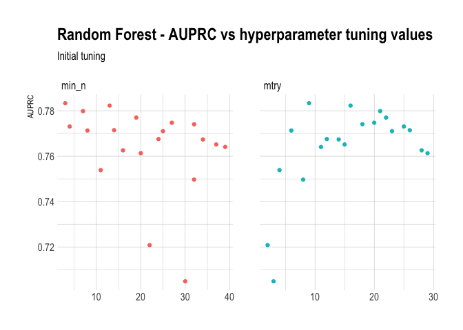
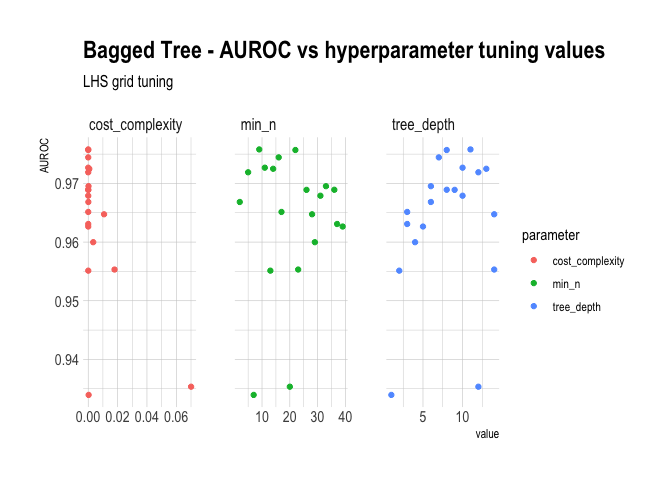

```r
# Set Up ------------------------------------------------------------------
```


```r
knitr::opts_chunk$set(warning=FALSE, message = FALSE)
```

```r
library(tidyverse)
library(tidymodels)
library(baguette)
library(themis)
library(vip)
library(kknn)
library(discrim)
library(here)
library(kableExtra)
library(hrbrthemes)
library(janitor)
library(skimr)
```

```r
RNGkind(sample.kind = "Rounding")
set.seed(1)
```

```r
theme_set(theme_ipsum())
```

```r
credit <- as_tibble(read_csv(here("data", "creditcard.csv")))
```

```r
credit <- credit %>%
  mutate(
    log_amount = log(Amount + 1),
    Class = case_when(
      Class == 0 ~ "None",
      Class == 1 ~ "Fraud"
    )
  ) %>%
  mutate(across(.cols = Class, .fns = factor)) %>%
  dplyr::select(-Amount)
```

```r
tabyl(credit$Class)
```

```
##  credit$Class      n     percent
##         Fraud    492 0.001727486
##          None 284315 0.998272514
```

```r
levels(credit$Class)
```

```
## [1] "Fraud" "None"
```

```r
# Pre-Processing ----------------------------------------------------------
```


Because there's a severe class imbalance, we should use subsampling (either oversampling or undersampling).
Subsampling has a few important points regarding the [workflow](https://www.tidymodels.org/learn/models/sub-sampling/):
- It is extremely important that subsampling occurs inside of resampling. Otherwise, the resampling process can produce poor estimates of model performance.
- The subsampling process should only be applied to the analysis set. The assessment set should reflect the event rates seen “in the wild” and, for this reason, the skip argument to step_downsample() and other subsampling recipes steps has a default of TRUE.


```r
set.seed(1234)
credit_split <- initial_split(credit, strata = "Class", prop = 0.8)
```

```r
credit_train <- training(credit_split)
credit_test <- testing(credit_split)
```

```r
tabyl(credit_train$Class)
```

```
##  credit_train$Class      n     percent
##               Fraud    403 0.001768739
##                None 227443 0.998231261
```

```r
tabyl(credit_test$Class)
```

```
##  credit_test$Class     n     percent
##              Fraud    89 0.001562473
##               None 56872 0.998437527
```

```r
# Create fold so same folds analyzed for every method
set.seed(1234)
credit_folds <- vfold_cv(credit_train, v = 10)
```

```r
# Create recipe so all folds are undergo same pre-processing
credit_rec <-
  recipe(Class ~ ., data = credit_train) %>%
  step_dummy(all_nominal(), -all_outcomes()) %>%
  step_zv(all_numeric()) %>%
  step_normalize(Time, log_amount) %>%
  step_downsample(Class)
```

```r
# Create workflow so all models can replicate same analysis methods
credit_wf <- workflow() %>%
  add_recipe(credit_rec)
```

```r
# Create list of metrics to record in model fits
model_mets <- metric_set(
  roc_auc, accuracy, sensitivity, specificity, j_index,
  ppv, npv, pr_auc
)
```

# Linear Models
## Logistic Regression


```r
# Logistic Regression -----------------------------------------------------
```

```r
# Specify logistic model
glm_spec <- logistic_reg() %>%
  set_engine("glm")
```

```r
# Fit logistic model to all folds in training data (resampling), saving certain metrics
# doParallel::registerDoParallel()
# glm_rs <- credit_wf %>%
#   add_model(glm_spec) %>%
#   fit_resamples(
#     resamples = credit_folds,
#     metrics = model_mets,
#     control = control_resamples(save_pred = TRUE)
#   )
# 
# saveRDS(glm_rs, here("out", "glm_rs.rds"))
glm_rs <- readRDS(here("out", "glm_rs.rds"))
```

```r
# Examine which variables are most important
glm_spec %>%
  set_engine("glm") %>%
  fit(Class ~ .,
    data = juice(prep(credit_rec))
  ) %>%
  vip(geom = "point") +
  labs(title = "Logistic Regression VIP")
```

<!-- -->

```r
ggsave(plot = last_plot(), path = here("out"), filename = "glm-vip.png")
```

```r
# Create roc curve
glm_roc <- glm_rs %>%
  collect_predictions() %>%
  roc_curve(truth = Class, .pred_Fraud) %>%
  mutate(model = "Logistic Regression")
```

```r
# Create Precision-Recall curve (PPV-Sensitivity)
glm_prc <- glm_rs %>%
  collect_predictions() %>%
  pr_curve(truth = Class, .pred_Fraud) %>%
  mutate(model = "Logistic Regression")
```

```r
# Create tibble of metrics
glm_met <- glm_rs %>%
  collect_metrics() %>%
  mutate(model = "Logistic Regression")
```

## GLMNET


```r
# GLMNET ------------------------------------------------------------------
```

```r
# Specify GLMNET model
glmnet_spec <- logistic_reg(
  penalty = tune(),
  mixture = tune()
) %>%
  set_engine("glmnet")
```

```r
# Create grid to tune penalty and mixture (Lasso vs Ridge)
glmnet_grid <- grid_latin_hypercube(
  penalty(),
  mixture(),
  size = 20
)
```

```r
# Tune GLMNET hyperparameters
# doParallel::registerDoParallel()
# set.seed(1234)
# glmnet_tune_rs <- tune_grid(
#   credit_wf %>% add_model(glmnet_spec),
#   resamples = credit_folds,
#   metrics = model_mets,
#   grid = glmnet_grid
# )
# 
# saveRDS(glmnet_tune_rs, file = here("out", "glmnet_tune_rs.rds"))
glmnet_tune_rs <- readRDS(here("out", "glmnet_tune_rs.rds"))
```

```r
# Examine AUC for hyperparameters
glmnet_tune_rs %>%
  collect_metrics() %>%
  filter(.metric == "roc_auc") %>%
  dplyr::select(mean, penalty, mixture) %>%
  pivot_longer(
    penalty:mixture,
    names_to = "parameter",
    values_to = "value"
  ) %>%
  ggplot(aes(x = value, y = mean, color = parameter)) +
  geom_point() +
  labs(
    y = "AUC",
    title = "GLMNET - AUROC vs hyperparameter tuning values",
    subtitle = "LHS grid tuning"
  ) +
  facet_wrap(~parameter, scales = "free_x")
```

<!-- -->

```r
ggsave(plot = last_plot(), path = here("out"), filename = "glmnet-roc-tune.png")
```

```r
best_glmnet_auc <- select_best(glmnet_tune_rs, metric = "roc_auc")
```

```r
# Specify optimized GLMNET model
glmnet_final_spec <- finalize_model(
  glmnet_spec,
  best_glmnet_auc
)
```

```r
# Examine which variables are most important
glmnet_final_spec %>%
  set_engine("glmnet", importance = "permutation") %>%
  fit(Class ~ .,
      data = juice(prep(credit_rec))
  ) %>%
  vip(geom = "point") +
  labs(title = "GLMNET VIP")
```

<!-- -->

```r
ggsave(plot = last_plot(), path = here("out"), filename = "glmnet-final-vip.png")
```

```r
# Fit GLMNET model to all folds in training data (resampling), saving certain metrics
# glmnet_final_rs <- credit_wf %>%
#   add_model(glmnet_final_spec) %>%
#   fit_resamples(
#     resamples = credit_folds,
#     metrics = model_mets,
#     control = control_resamples(save_pred = TRUE)
#   )
# 
# saveRDS(glmnet_final_rs, file = here("out", "glmnet_final_rs.rds"))
glmnet_final_rs <- readRDS(here("out", "glmnet_final_rs.rds"))
```

```r
# Create roc curve
glmnet_final_roc <- glmnet_final_rs %>%
  collect_predictions() %>%
  roc_curve(truth = Class, .pred_Fraud) %>%
  mutate(model = "GLMNET")
```

```r
# Create Precision-Recall curve (PPV-Sensitivity)
glmnet_final_prc <- glmnet_final_rs %>%
  collect_predictions() %>%
  pr_curve(truth = Class, .pred_Fraud) %>%
  mutate(model = "GLMNET")
```

```r
# Create tibble of metrics
glmnet_final_met <- glmnet_final_rs %>%
  collect_metrics() %>%
  mutate(model = "GLMNET")
```

# Discriminant Analysis
## LDA


```r
# LDA ---------------------------------------------------------------------
```

```r
# Specify LDA model
lda_spec <- discrim_linear() %>%
  set_engine("MASS")
```

```r
# Fit logistic model to all folds in training data (resampling), saving certain metrics
# doParallel::registerDoParallel()
# lda_rs <- credit_wf %>%
#   add_model(lda_spec) %>%
#   fit_resamples(
#     resamples = credit_folds,
#     metrics = model_mets,
#     control = control_resamples(save_pred = TRUE)
#   )
#
# saveRDS(lda_rs, here("out", "lda_rs.rds"))
lda_rs <- readRDS(here("out", "lda_rs.rds"))
```

```r
# Create roc curve
lda_roc <- lda_rs %>%
  collect_predictions() %>%
  roc_curve(truth = Class, .pred_Fraud) %>%
  mutate(model = "LDA")
```

```r
# Create Precision-Recall curve (PPV-Sensitivity)
lda_prc <- lda_rs %>%
  collect_predictions() %>%
  pr_curve(truth = Class, .pred_Fraud) %>%
  mutate(model = "LDA")
```

```r
# Create tibble of metrics
lda_met <- lda_rs %>%
  collect_metrics() %>%
  mutate(model = "LDA")
```

# QDA


```r
# QDA ---------------------------------------------------------------------
```

```r
qda_spec <- discrim_regularized(frac_common_cov = 0, frac_identity = 0) %>%
  set_engine("klaR")
```

```r
# Fit QDA model to all folds in training data (resampling), saving certain metrics
# doParallel::registerDoParallel()
# qda_rs <- credit_wf %>%
#   add_model(qda_spec) %>%
#   fit_resamples(
#     resamples = credit_folds,
#     metrics = model_mets,
#     control = control_resamples(save_pred = TRUE)
#   )
# 
# saveRDS(qda_rs, here("out", "qda_rs.rds"))
qda_rs <- readRDS(here("out", "qda_rs.rds"))
```

```r
# Create roc curve
qda_roc <- qda_rs %>%
  collect_predictions() %>%
  roc_curve(truth = Class, .pred_Fraud) %>%
  mutate(model = "QDA")
```

```r
# Create Precision-Recall curve (PPV-Sensitivity)
qda_prc <- qda_rs %>%
  collect_predictions() %>%
  pr_curve(truth = Class, .pred_Fraud) %>%
  mutate(model = "QDA")
```

```r
# Create tibble of metrics
qda_met <- qda_rs %>%
  collect_metrics() %>%
  mutate(model = "QDA")
```


## Random Forest


```r
# Random Forest -----------------------------------------------------------
```

```r
# Specify random forest model
rf_spec <- rand_forest(
  mtry = tune(),
  trees = 500,
  min_n = tune()
) %>%
  set_engine("ranger") %>%
  set_mode("classification")
```

```r
# Tune random forest hyperparameters
# doParallel::registerDoParallel()
# set.seed(1234)
# rf_tune_rs <- tune_grid(
#   credit_wf %>% add_model(rf_spec),
#   resamples = credit_folds,
#   metrics = model_mets,
#   grid = 20
# )
# 
# saveRDS(rf_tune_rs, file = here("out", "rf_tune_rs.rds"))
rf_tune_rs <- readRDS(here("out", "rf_tune_rs.rds"))
```

```r
rf_tune_rs %>%
  collect_metrics() %>%
  filter(.metric == "roc_auc") %>%
  dplyr::select(mean, min_n, mtry) %>%
  pivot_longer(
    cols = min_n:mtry,
    values_to = "value",
    names_to = "parameter"
  ) %>%
  ggplot(aes(x = value, y = mean, color = parameter)) +
  geom_point(show.legend = FALSE) +
  facet_wrap(~parameter, scales = "free_x") +
  labs(
    x = NULL, y = "AUC",
    title = "Random Forest - AUROC vs hyperparameter tuning values",
    subtitle = "Initial tuning"
  )
```

<!-- -->

```r
ggsave(plot = last_plot(), path = here("out"), filename = "rf-initial-roc-tune.png")
```

We can see that lower values of `min_n` are better, and no pattern with `mtry`.
Let's create a regular grid to do a finer optimization.


```r
rf_grid <- grid_regular(
  mtry(range = c(0, 25)),
  min_n(range = c(1, 10)),
  levels = 6
)

rf_grid
```

```
## # A tibble: 36 x 2
##     mtry min_n
##    <int> <int>
##  1     0     1
##  2     5     1
##  3    10     1
##  4    15     1
##  5    20     1
##  6    25     1
##  7     0     2
##  8     5     2
##  9    10     2
## 10    15     2
## # … with 26 more rows
```

```r
# Fit Random Forest with regular tuning grid that is more focussed
# doParallel::registerDoParallel()
# set.seed(1234)
# rf_reg_tune_rs <- tune_grid(
#   credit_wf %>% add_model(rf_spec),
#   resamples = credit_folds,
#   metrics = model_mets,
#   grid = rf_grid
# )
# 
# saveRDS(rf_reg_tune_rs, file = here("out", "rf_reg_tune_rs.rds"))
rf_reg_tune_rs <- readRDS(here("out", "rf_reg_tune_rs.rds"))
```

```r
# Examine AUC for hyperparameters
rf_reg_tune_rs %>%
  collect_metrics() %>%
  filter(.metric == "roc_auc") %>%
  mutate(min_n = factor(min_n)) %>%
  ggplot(aes(x = mtry, y = mean, color = min_n)) +
  geom_line(alpha = 0.5, size = 1.5) +
  geom_point() +
  labs(
    y = "AUC",
    title = "Random Forest - AUROC vs hyperparameter tuning values",
    subtitle = "Regular grid tuning"
  )
```

<!-- -->

```r
ggsave(plot = last_plot(), path = here("out"), filename = "rf-grid-roc-tune.png")
```

```r
# Examine accuracy for hyperparameters
rf_reg_tune_rs %>%
  collect_metrics() %>%
  filter(.metric == "accuracy") %>%
  mutate(min_n = factor(min_n)) %>%
  ggplot(aes(x = mtry, y = mean, color = min_n)) +
  geom_line(alpha = 0.5, size = 1.5) +
  geom_point() +
  labs(
    y = "Accuracy",
    title = "Random Forest - Accuracy vs hyperparameter tuning values",
    subtitle = "Regular grid tuning"
  )
```

<!-- -->

```r
ggsave(plot = last_plot(), path = here("out"), filename = "rf-grid-acc-tune.png")
```

We can see from the plot of AUC that the best combination is `min_n = 1`, and
`mtry = 10`. There seems to be a decline in accuracy from `mtry = 5`, however,
this is likely due to reduced sensitivity and improved specificity, which is
the opposite of what we're interested in given the class imbalance.
It is generally accepted that good starting points are `mtry = sqrt(p)` (c. 5)
and `min_n = 1` for classification models (https://bradleyboehmke.github.io/HOML/random-forest.html)


```r
best_rf_auc <- select_best(rf_reg_tune_rs, "roc_auc")
```

```r
rf_final_spec <- finalize_model(
  rf_spec,
  best_rf_auc
)
```

```r
# Examine which variables are most important
set.seed(1234)
rf_final_spec %>%
  set_engine("ranger", importance = "permutation") %>%
  fit(Class ~ .,
    data = juice(prep(credit_rec))
  ) %>%
  vip(geom = "point") +
  labs(title = "Random Forest VIP")
```

<!-- -->

```r
ggsave(plot = last_plot(), path = here("out"), filename = "rf-final-vip.png")
```

Important to note that PCA is unsupervised so only looks at relevance to the
variance observed in the predictors, not at their relevance to the outcome,
so not necessary that PC1 would be the most important PC in predicting Class


```r
# Fit random forest model to all folds in training data (resampling), saving certain metrics
# rf_final_rs <- credit_wf %>%
#   add_model(rf_final_spec) %>%
#   fit_resamples(
#     resamples = credit_folds,
#     metrics = model_mets,
#     control = control_resamples(save_pred = TRUE)
#   )
# 
# saveRDS(rf_final_rs, file = here("out", "rf_final_rs.rds"))
rf_final_rs <- readRDS(here("out", "rf_final_rs.rds"))
```

```r
# Create roc curve
rf_final_roc <- rf_final_rs %>%
  collect_predictions() %>%
  roc_curve(truth = Class, .pred_Fraud) %>%
  mutate(model = "Random Forest")
```

```r
# Create Precision-Recall curve (PPV-Sensitivity)
rf_final_prc <- rf_final_rs %>%
  collect_predictions() %>%
  pr_curve(truth = Class, .pred_Fraud) %>%
  mutate(model = "Random Forest")
```

```r
# Create tibble of metrics
rf_final_met <- rf_final_rs %>%
  collect_metrics() %>%
  mutate(model = "Random Forest")
```

## XGBoost


```r
# XGBoost -----------------------------------------------------------------
```

```r
# Specify boosted tree model
xgb_spec <- boost_tree(
  trees = 500,
  tree_depth = tune(),
  min_n = tune(),
  loss_reduction = tune(),
  sample_size = tune(),
  mtry = tune(),
  learn_rate = tune()
) %>%
  set_engine("xgboost") %>%
  set_mode("classification")
```

```r
# Create space filling parameter latin hypercube grid - regular grid too slow
xgb_grid <- grid_latin_hypercube(
  tree_depth(),
  min_n(),
  loss_reduction(),
  sample_size = sample_prop(),
  finalize(mtry(), credit_train),
  learn_rate(),
  size = 20
)
```

```r
# Tune XGBoost hyperparameters using space filling parameter grid
# doParallel::registerDoParallel()
# set.seed(1234)
# xgb_tune_rs <- tune_grid(
#   credit_wf %>% add_model(xgb_spec),
#   resamples = credit_folds,
#   metrics = model_mets,
#   grid = xgb_grid
# )
# 
# saveRDS(xgb_tune_rs, file = here("out", "xgb_tune_rs.rds"))
xgb_tune_rs <- readRDS(here("out", "xgb_tune_rs.rds"))
```

```r
# Examine AUC for hyperparameters
xgb_tune_rs %>%
  collect_metrics() %>%
  filter(.metric == "roc_auc") %>%
  dplyr::select(mean, mtry:sample_size) %>%
  pivot_longer(
    mtry:sample_size,
    names_to = "parameter",
    values_to = "value"
  ) %>%
  ggplot(aes(x = value, y = mean, color = parameter)) +
  geom_point() +
  labs(
    y = "AUC",
    title = "XGBoost - AUROC vs hyperparameter tuning values",
    subtitle = "LHS grid tuning"
  ) +
  facet_wrap(~parameter, scales = "free_x")
```

<!-- -->

```r
ggsave(plot = last_plot(), path = here("out"), filename = "xgb-roc-tune.png")
```

```r
show_best(xgb_tune_rs, "roc_auc")
```

```
## # A tibble: 5 x 12
##    mtry min_n tree_depth learn_rate loss_reduction sample_size .metric
##   <int> <int>      <int>      <dbl>          <dbl>       <dbl> <chr>  
## 1    31     2          9    4.07e-2   0.0395             0.750 roc_auc
## 2    15     5          4    2.26e-6   0.00000429         0.204 roc_auc
## 3    18    25         10    7.61e-8   0.00109            0.786 roc_auc
## 4    28    10         13    2.72e-4   2.34               0.351 roc_auc
## 5     4    17          7    7.62e-6   0.0000000594       0.552 roc_auc
## # … with 5 more variables: .estimator <chr>, mean <dbl>, n <int>,
## #   std_err <dbl>, .config <chr>
```

```r
best_xgb_auc <- select_best(xgb_tune_rs, "roc_auc")
```

```r
xgb_final_spec <- finalize_model(
  xgb_spec,
  best_xgb_auc
)
```

```r
# Examine which variables are most important
set.seed(1234)
xgb_final_spec %>%
  set_engine("xgboost", importance = "permutation") %>%
  fit(Class ~ .,
    data = juice(prep(credit_rec))
  ) %>%
  vip(geom = "point") +
  labs(title = "XGBoost VIP")
```

```
## [16:20:50] WARNING: amalgamation/../src/learner.cc:516: 
## Parameters: { importance } might not be used.
## 
##   This may not be accurate due to some parameters are only used in language bindings but
##   passed down to XGBoost core.  Or some parameters are not used but slip through this
##   verification. Please open an issue if you find above cases.
```

<!-- -->

```r
ggsave(plot = last_plot(), path = here("out"), filename = "xgb-final-vip.png")
```

```r
# Fit XGBoost model to all folds in training data (resampling), saving certain metrics
# xgb_final_rs <- credit_wf %>%
#   add_model(xgb_final_spec) %>%
#   fit_resamples(
#     resamples = credit_folds,
#     metrics = model_mets,
#     control = control_resamples(save_pred = TRUE)
#   )
# 
# saveRDS(xgb_final_rs, file = here("out", "xgb_final_rs.rds"))
xgb_final_rs <- readRDS(here("out", "xgb_final_rs.rds"))
```

```r
# Create roc curve
xgb_final_roc <- xgb_final_rs %>%
  collect_predictions() %>%
  roc_curve(truth = Class, .pred_Fraud) %>%
  mutate(model = "XGBoost")
```

```r
# Create Precision-Recall curve (PPV-Sensitivity)
xgb_final_prc <- xgb_final_rs %>%
  collect_predictions() %>%
  pr_curve(truth = Class, .pred_Fraud) %>%
  mutate(model = "XGBoost")
```

```r
# Create tibble of metrics
xgb_final_met <- xgb_final_rs %>%
  collect_metrics() %>%
  mutate(model = "XGBoost")
```

## Bagged Tree


```r
# Bagged Tree -------------------------------------------------------------
```

```r
# Specify bagged tree model
bag_spec <- bag_tree(
  cost_complexity = tune(),
  tree_depth = tune(),
  min_n = tune()
) %>%
  set_engine("rpart") %>%
  set_mode("classification")
```

```r
# Create space filling parameter latin hypercube grid - regular grid too slow
bag_grid <- grid_latin_hypercube(
  cost_complexity(),
  tree_depth(),
  min_n(),
  size = 20
)
```

```r
# Tune bagged tree hyperparameters using space filling parameter grid
# doParallel::registerDoParallel()
# set.seed(1234)
# bag_tune_rs <- tune_grid(
#   credit_wf %>% add_model(bag_spec),
#   resamples = credit_folds,
#   metrics = model_mets,
#   grid = bag_grid
# )
# 
# saveRDS(bag_tune_rs, file = here("out", "bag_tune_rs.rds"))
bag_tune_rs <- readRDS(here("out", "bag_tune_rs.rds"))
```

```r
# Examine AUC for hyperparameters
bag_tune_rs %>%
  collect_metrics() %>%
  filter(.metric == "roc_auc") %>%
  dplyr::select(mean, cost_complexity:min_n) %>%
  pivot_longer(
    cost_complexity:min_n,
    names_to = "parameter",
    values_to = "value"
  ) %>%
  ggplot(aes(x = value, y = mean, color = parameter)) +
  geom_point() +
  labs(
    y = "AUC",
    title = "Bagged Tree - AUROC vs hyperparameter tuning values",
    subtitle = "LHS grid tuning"
  ) +
  facet_wrap(~parameter, scales = "free_x")
```

<!-- -->

```r
ggsave(plot = last_plot(), path = here("out"), filename = "bag-roc-tune.png")
```

```r
show_best(bag_tune_rs, "roc_auc")
```

```
## # A tibble: 5 x 9
##   cost_complexity tree_depth min_n .metric .estimator  mean     n std_err
##             <dbl>      <int> <int> <chr>   <chr>      <dbl> <int>   <dbl>
## 1   0.00000667            11     9 roc_auc binary     0.976    10 0.00557
## 2   0.000000885            8    22 roc_auc binary     0.976    10 0.00430
## 3   0.00000000141          7    16 roc_auc binary     0.974    10 0.00452
## 4   0.0000000334          10    11 roc_auc binary     0.973    10 0.00540
## 5   0.000714              13    14 roc_auc binary     0.972    10 0.00574
## # … with 1 more variable: .config <chr>
```

```r
# Select best parameters from tuning grid based on AUC
best_bag_auc <- select_best(bag_tune_rs, "roc_auc")
```

```r
# Specify optimized bagged tree model
bag_final_spec <- finalize_model(
  bag_spec,
  best_bag_auc
)
```

```r
# Examine which variables are most important
set.seed(1234)
bag_imp <- bag_final_spec %>%
  set_engine("rpart") %>%
  fit(Class ~ .,
    data = juice(prep(credit_rec))
  )
```

```r
bag_imp$fit$imp %>%
  mutate(term = fct_reorder(term, value)) %>%
  ggplot(aes(x = value, y = term)) +
  geom_point() +
  labs(title = "Bagged Tree VIP")
```

<!-- -->

```r
ggsave(plot = last_plot(), path = here("out"), filename = "bag-final-vip.png")
```

```r
# Fit bagged tree model to all folds in training data (resampling), saving certain metrics
# bag_final_rs <- credit_wf %>%
#   add_model(bag_final_spec) %>%
#   fit_resamples(
#     resamples = credit_folds,
#     metrics = model_mets,
#     control = control_resamples(save_pred = TRUE)
#   )
# 
# saveRDS(bag_final_rs, file = here("out", "bag_final_rs.rds"))
bag_final_rs <- readRDS(here("out", "bag_final_rs.rds"))
```

```r
# Create roc curve
bag_final_roc <- bag_final_rs %>%
  collect_predictions() %>%
  roc_curve(truth = Class, .pred_Fraud) %>%
  mutate(model = "Bagged Tree")
```

```r
# Create Precision-Recall curve (PPV-Sensitivity)
bag_final_prc <- bag_final_rs %>%
  collect_predictions() %>%
  pr_curve(truth = Class, .pred_Fraud) %>%
  mutate(model = "Bagged Tree")
```

```r
# Create tibble of metrics
bag_final_met <- bag_final_rs %>%
  collect_metrics() %>%
  mutate(model = "Bagged Tree")
```

# SVM Methods
## SVM - Radial Kernel


```r
# SVM - Radial ------------------------------------------------------------
```

```r
# Specify SVM-Radial model
svmr_spec <- svm_rbf(
  cost = tune(),
  rbf_sigma = tune()
) %>%
  set_engine("kernlab") %>%
  set_mode("classification")
```

```r
svmr_grid <- grid_latin_hypercube(
  cost(),
  rbf_sigma(),
  size = 20
)
```

```r
# Tune SVM-Radial hyperparameters
# doParallel::registerDoParallel()
# set.seed(1234)
# svmr_tune_rs <- tune_grid(
#   credit_wf %>% add_model(svmr_spec),
#   resamples = credit_folds,
#   metrics = model_mets,
#   grid = svmr_grid
# )
# 
# saveRDS(svmr_tune_rs, file = here("out", "svmr_tune_rs.rds"))
svmr_tune_rs <- readRDS(here("out", "svmr_tune_rs.rds"))
```

```r
# Examine AUC for hyperparameters
svmr_tune_rs %>%
  collect_metrics() %>%
  filter(.metric == "roc_auc") %>%
  dplyr::select(mean, cost, rbf_sigma) %>%
  pivot_longer(
    cost:rbf_sigma,
    names_to = "parameter",
    values_to = "value"
  ) %>%
  ggplot(aes(x = value, y = mean, color = parameter)) +
  geom_point() +
  labs(
    y = "AUC",
    title = "SVM Radial - AUROC vs hyperparameter tuning values",
    subtitle = "LHS grid tuning"
  ) +
  facet_wrap(~parameter, scales = "free_x")
```

<!-- -->

```r
ggsave(plot = last_plot(), path = here("out"), filename = "svmr-roc-tune.png")
```

```r
best_svmr_auc <- select_best(svmr_tune_rs, metric = "roc_auc")
```

```r
# Specify optimized svm model
svmr_final_spec <- finalize_model(
  svmr_spec,
  best_svmr_auc
)
```

```r
# Fit svm model to all folds in training data (resampling), saving certain metrics
# svmr_final_rs <- credit_wf %>%
#   add_model(svmr_final_spec) %>%
#   fit_resamples(
#     resamples = credit_folds,
#     metrics = model_mets,
#     control = control_resamples(save_pred = TRUE)
#   )
# 
# saveRDS(svmr_final_rs, file = here("out", "svmr_final_rs.rds"))
svmr_final_rs <- readRDS(here("out", "svmr_final_rs.rds"))
```

```r
# Create roc curve
svmr_final_roc <- svmr_final_rs %>%
  collect_predictions() %>%
  roc_curve(truth = Class, .pred_Fraud) %>%
  mutate(model = "SVM-R")
```

```r
# Create Precision-Recall curve (PPV-Sensitivity)
svmr_final_prc <- svmr_final_rs %>%
  collect_predictions() %>%
  pr_curve(truth = Class, .pred_Fraud) %>%
  mutate(model = "SVM-R")
```

```r
# Create tibble of metrics
svmr_final_met <- svmr_final_rs %>%
  collect_metrics() %>%
  mutate(model = "SVM-R")
```

## SVM - Polynomial Kernel


```r
# SVM - Polynomial --------------------------------------------------------
```

```r
# Specify SVM-Polynomial model
svmp_spec <- svm_poly(
  cost = tune(),
  degree = tune(),
  scale_factor = tune()
) %>%
  set_engine("kernlab") %>%
  set_mode("classification")
```

```r
svmp_grid <- grid_latin_hypercube(
  cost(),
  degree(),
  scale_factor(),
  size = 20
)
```

```r
# Tune SVM-P hyperparameters
# doParallel::registerDoParallel()
# set.seed(1234)
# svmp_tune_rs <- tune_grid(
#   credit_wf %>% add_model(svmp_spec),
#   resamples = credit_folds,
#   metrics = model_mets,
#   grid = svmp_grid
# )
# 
# saveRDS(svmp_tune_rs, file = here("out", "svmp_tune_rs.rds"))
svmp_tune_rs <- readRDS(here("out", "svmp_tune_rs.rds"))
```

```r
# Examine AUC for hyperparameters
svmp_tune_rs %>%
  collect_metrics() %>%
  filter(.metric == "roc_auc") %>%
  dplyr::select(mean, cost:scale_factor) %>%
  pivot_longer(
    cost:scale_factor,
    names_to = "parameter",
    values_to = "value"
  ) %>%
  ggplot(aes(x = value, y = mean, color = parameter)) +
  geom_point() +
  labs(
    y = "AUC",
    title = "SVM Polynomial - AUROC vs hyperparameter tuning values",
    subtitle = "LHS grid tuning"
  ) +
  facet_wrap(~parameter, scales = "free_x")
```

<!-- -->

```r
ggsave(plot = last_plot(), path = here("out"), filename = "svmp-roc-tune.png")
```

```r
best_svmp_auc <- select_best(svmp_tune_rs, metric = "roc_auc")
```

```r
# Specify optimized svm model
svmp_final_spec <- finalize_model(
  svmp_spec,
  best_svmp_auc
)
```

```r
# Fit svm model to all folds in training data (resampling), saving certain metrics
# svmp_final_rs <- credit_wf %>%
#   add_model(svmp_final_spec) %>%
#   fit_resamples(
#     resamples = credit_folds,
#     metrics = model_mets,
#     control = control_resamples(save_pred = TRUE)
#   )
# 
# saveRDS(svmp_final_rs, file = here("out", "svmp_final_rs.rds"))
svmp_final_rs <- readRDS(here("out", "svmp_final_rs.rds"))
```

```r
# Create roc curve
svmp_final_roc <- svmp_final_rs %>%
  collect_predictions() %>%
  roc_curve(truth = Class, .pred_Fraud) %>%
  mutate(model = "SVM-P")
```

```r
# Create Precision-Recall curve (PPV-Sensitivity)
svmp_final_prc <- svmp_final_rs %>%
  collect_predictions() %>%
  pr_curve(truth = Class, .pred_Fraud) %>%
  mutate(model = "SVM-P")
```

```r
# Create tibble of metrics
svmp_final_met <- svmp_final_rs %>%
  collect_metrics() %>%
  mutate(model = "SVM-P")
```

# kNN


```r
# kNN ---------------------------------------------------------------------
```

```r
# Specify kNN model
knn_spec <- nearest_neighbor(
  neighbors = tune()
) %>%
  set_engine("kknn") %>%
  set_mode("classification")
```

```r
knn_grid <- grid_regular(
  neighbors(range = c(1, 70)),
  levels = 51
)
```

```r
knn_grid
```

```
## # A tibble: 51 x 1
##    neighbors
##        <int>
##  1         1
##  2         2
##  3         3
##  4         5
##  5         6
##  6         7
##  7         9
##  8        10
##  9        12
## 10        13
## # … with 41 more rows
```

```r
# Tune kNN hyperparameters
# doParallel::registerDoParallel()
# set.seed(1234)
# knn_tune_rs <- tune_grid(
#   credit_wf %>% add_model(knn_spec),
#   resamples = credit_folds,
#   metrics = model_mets,
#   grid = knn_grid
# )
# 
# saveRDS(knn_tune_rs, file = here("out", "knn_tune_rs.rds"))
knn_tune_rs <- readRDS(here("out", "knn_tune_rs.rds"))
```

```r
# Examine AUC for hyperparameters
knn_tune_rs %>%
  collect_metrics() %>%
  filter(.metric == "roc_auc") %>%
  dplyr::select(mean, neighbors) %>%
  ggplot(aes(x = neighbors, y = mean)) +
  geom_point() +
  labs(
    y = "AUC",
    title = "kNN - AUROC vs hyperparameter tuning values",
    subtitle = "Regular grid tuning"
  )
```

<!-- -->

```r
ggsave(plot = last_plot(), path = here("out"), filename = "knn-roc-tune.png")
```

```r
best_knn_auc <- select_best(knn_tune_rs, metric = "roc_auc")
```

A high k isn't an issue as it is more biased towards underfitting (i.e. 
higher bias, but much lower variance) so AUC improves


```r
# Specify optimized svm model
knn_final_spec <- finalize_model(
  knn_spec,
  best_knn_auc
)
```

```r
# Fit kNN model to all folds in training data (resampling), saving certain metrics
# knn_final_rs <- credit_wf %>%
#   add_model(knn_final_spec) %>%
#   fit_resamples(
#     resamples = credit_folds,
#     metrics = model_mets,
#     control = control_resamples(save_pred = TRUE)
#   )
# 
# saveRDS(knn_final_rs, file = here("out", "knn_final_rs.rds"))
knn_final_rs <- readRDS(here("out", "knn_final_rs.rds"))
```

```r
# Create roc curve
knn_final_roc <- knn_final_rs %>%
  collect_predictions() %>%
  roc_curve(truth = Class, .pred_Fraud) %>%
  mutate(model = "kNN")
```

```r
# Create Precision-Recall curve (PPV-Sensitivity)
knn_final_prc <- knn_final_rs %>%
  collect_predictions() %>%
  pr_curve(truth = Class, .pred_Fraud) %>%
  mutate(model = "kNN")
```

```r
# Create tibble of metrics
knn_final_met <- knn_final_rs %>%
  collect_metrics() %>%
  mutate(model = "kNN")
```

# Model Evaluation
## Metric Summaries


```r
# Evaluate Metrics ---------------------------------------------------------
```

```r
all_met <- bind_rows(
  glm_met, lda_met, rf_final_met, xgb_final_met, bag_final_met,
  glmnet_final_met, svmr_final_met, svmp_final_met, knn_final_met
)
```

```r
# Rank all models by AUC
all_met %>%
  filter(.metric == "roc_auc") %>%
  arrange(desc(mean))
```

```
## # A tibble: 9 x 7
##   .metric .estimator  mean     n std_err .config              model             
##   <chr>   <chr>      <dbl> <int>   <dbl> <chr>                <chr>             
## 1 roc_auc binary     0.983    10 0.00441 Preprocessor1_Model1 SVM-R             
## 2 roc_auc binary     0.979    10 0.00461 Preprocessor1_Model1 XGBoost           
## 3 roc_auc binary     0.978    10 0.00597 Preprocessor1_Model1 Random Forest     
## 4 roc_auc binary     0.977    10 0.00620 Preprocessor1_Model1 GLMNET            
## 5 roc_auc binary     0.977    10 0.00840 Preprocessor1_Model1 SVM-P             
## 6 roc_auc binary     0.976    10 0.00764 Preprocessor1_Model1 Logistic Regressi…
## 7 roc_auc binary     0.974    10 0.00434 Preprocessor1_Model1 kNN               
## 8 roc_auc binary     0.966    10 0.00427 Preprocessor1_Model1 LDA               
## 9 roc_auc binary     0.965    10 0.00720 Preprocessor1_Model1 Bagged Tree
```

```r
# Rank all models by sensitivity
all_met %>%
  filter(.metric == "sens") %>%
  arrange(desc(mean))
```

```
## # A tibble: 9 x 7
##   .metric .estimator  mean     n std_err .config              model             
##   <chr>   <chr>      <dbl> <int>   <dbl> <chr>                <chr>             
## 1 sens    binary     0.924    10  0.0141 Preprocessor1_Model1 Logistic Regressi…
## 2 sens    binary     0.909    10  0.0120 Preprocessor1_Model1 XGBoost           
## 3 sens    binary     0.907    10  0.0134 Preprocessor1_Model1 Bagged Tree       
## 4 sens    binary     0.904    10  0.0137 Preprocessor1_Model1 Random Forest     
## 5 sens    binary     0.881    10  0.0115 Preprocessor1_Model1 GLMNET            
## 6 sens    binary     0.881    10  0.0156 Preprocessor1_Model1 SVM-R             
## 7 sens    binary     0.844    10  0.0122 Preprocessor1_Model1 LDA               
## 8 sens    binary     0.836    10  0.0138 Preprocessor1_Model1 SVM-P             
## 9 sens    binary     0.808    10  0.0185 Preprocessor1_Model1 kNN
```

```r
# Rank all models by specificity
all_met %>%
  filter(.metric == "spec") %>%
  arrange(desc(mean))
```

```
## # A tibble: 9 x 7
##   .metric .estimator  mean     n  std_err .config             model             
##   <chr>   <chr>      <dbl> <int>    <dbl> <chr>               <chr>             
## 1 spec    binary     0.999    10 0.000115 Preprocessor1_Mode… SVM-P             
## 2 spec    binary     0.998    10 0.000131 Preprocessor1_Mode… kNN               
## 3 spec    binary     0.990    10 0.000308 Preprocessor1_Mode… GLMNET            
## 4 spec    binary     0.984    10 0.00149  Preprocessor1_Mode… LDA               
## 5 spec    binary     0.984    10 0.000787 Preprocessor1_Mode… SVM-R             
## 6 spec    binary     0.968    10 0.00225  Preprocessor1_Mode… Random Forest     
## 7 spec    binary     0.968    10 0.00143  Preprocessor1_Mode… XGBoost           
## 8 spec    binary     0.959    10 0.00212  Preprocessor1_Mode… Bagged Tree       
## 9 spec    binary     0.955    10 0.00256  Preprocessor1_Mode… Logistic Regressi…
```

```r
# Rank all models by accuracy
all_met %>%
  filter(.metric == "accuracy") %>%
  arrange(desc(mean))
```

```
## # A tibble: 9 x 7
##   .metric  .estimator  mean     n  std_err .config             model            
##   <chr>    <chr>      <dbl> <int>    <dbl> <chr>               <chr>            
## 1 accuracy binary     0.998    10 0.000117 Preprocessor1_Mode… SVM-P            
## 2 accuracy binary     0.998    10 0.000135 Preprocessor1_Mode… kNN              
## 3 accuracy binary     0.990    10 0.000315 Preprocessor1_Mode… GLMNET           
## 4 accuracy binary     0.984    10 0.00147  Preprocessor1_Mode… LDA              
## 5 accuracy binary     0.984    10 0.000777 Preprocessor1_Mode… SVM-R            
## 6 accuracy binary     0.968    10 0.00225  Preprocessor1_Mode… Random Forest    
## 7 accuracy binary     0.968    10 0.00142  Preprocessor1_Mode… XGBoost          
## 8 accuracy binary     0.959    10 0.00212  Preprocessor1_Mode… Bagged Tree      
## 9 accuracy binary     0.955    10 0.00255  Preprocessor1_Mode… Logistic Regress…
```

Important to note that the no information rate (the baseline accuracy because
it is achieved by always predicting the majority class "No fraud") is 99% 
( / 227846)


```r
# Rank all models by AUPRC
all_met %>%
  filter(.metric == "pr_auc") %>%
  arrange(desc(mean))
```

```
## # A tibble: 9 x 7
##   .metric .estimator  mean     n std_err .config              model             
##   <chr>   <chr>      <dbl> <int>   <dbl> <chr>                <chr>             
## 1 pr_auc  binary     0.782    10  0.0213 Preprocessor1_Model1 Random Forest     
## 2 pr_auc  binary     0.747    10  0.0263 Preprocessor1_Model1 XGBoost           
## 3 pr_auc  binary     0.718    10  0.0193 Preprocessor1_Model1 kNN               
## 4 pr_auc  binary     0.713    10  0.0235 Preprocessor1_Model1 GLMNET            
## 5 pr_auc  binary     0.690    10  0.0275 Preprocessor1_Model1 SVM-P             
## 6 pr_auc  binary     0.690    10  0.0215 Preprocessor1_Model1 SVM-R             
## 7 pr_auc  binary     0.664    10  0.0180 Preprocessor1_Model1 Logistic Regressi…
## 8 pr_auc  binary     0.316    10  0.0569 Preprocessor1_Model1 Bagged Tree       
## 9 pr_auc  binary     0.200    10  0.0293 Preprocessor1_Model1 LDA
```

```r
# Rank all models by PPV
all_met %>%
  filter(.metric == "ppv") %>%
  arrange(desc(mean))
```

```
## # A tibble: 9 x 7
##   .metric .estimator   mean     n std_err .config              model            
##   <chr>   <chr>       <dbl> <int>   <dbl> <chr>                <chr>            
## 1 ppv     binary     0.525     10 0.0196  Preprocessor1_Model1 SVM-P            
## 2 ppv     binary     0.438     10 0.0233  Preprocessor1_Model1 kNN              
## 3 ppv     binary     0.133     10 0.00553 Preprocessor1_Model1 GLMNET           
## 4 ppv     binary     0.0938    10 0.0112  Preprocessor1_Model1 LDA              
## 5 ppv     binary     0.0893    10 0.00535 Preprocessor1_Model1 SVM-R            
## 6 ppv     binary     0.0506    10 0.00442 Preprocessor1_Model1 Random Forest    
## 7 ppv     binary     0.0494    10 0.00326 Preprocessor1_Model1 XGBoost          
## 8 ppv     binary     0.0388    10 0.00275 Preprocessor1_Model1 Bagged Tree      
## 9 ppv     binary     0.0359    10 0.00236 Preprocessor1_Model1 Logistic Regress…
```

```r
# Rank all models by NPV
all_met %>%
  filter(.metric == "npv") %>%
  arrange(desc(mean))
```

```
## # A tibble: 9 x 7
##   .metric .estimator  mean     n   std_err .config             model            
##   <chr>   <chr>      <dbl> <int>     <dbl> <chr>               <chr>            
## 1 npv     binary      1.00    10 0.0000269 Preprocessor1_Mode… Logistic Regress…
## 2 npv     binary      1.00    10 0.0000224 Preprocessor1_Mode… XGBoost          
## 3 npv     binary      1.00    10 0.0000263 Preprocessor1_Mode… Bagged Tree      
## 4 npv     binary      1.00    10 0.0000248 Preprocessor1_Mode… Random Forest    
## 5 npv     binary      1.00    10 0.0000218 Preprocessor1_Mode… GLMNET           
## 6 npv     binary      1.00    10 0.0000272 Preprocessor1_Mode… SVM-R            
## 7 npv     binary      1.00    10 0.0000255 Preprocessor1_Mode… LDA              
## 8 npv     binary      1.00    10 0.0000247 Preprocessor1_Mode… SVM-P            
## 9 npv     binary      1.00    10 0.0000301 Preprocessor1_Mode… kNN
```

```r
# Plot ROC curves
bind_rows(
  glm_roc, lda_roc, qda_roc, glmnet_final_roc,
  rf_final_roc, xgb_final_roc, bag_final_roc,
  svmr_final_roc, svmp_final_roc, knn_final_roc
) %>%
  ggplot(aes(x = 1 - specificity, y = sensitivity, col = model)) +
  geom_path(lwd = 1.5, alpha = 0.8) +
  geom_abline(lty = 2, col = "grey80") +
  coord_equal() +
  labs(title = "ROC plots for all models")
```

<!-- -->

```r
ggsave(plot = last_plot(), path = here("out"), filename = "roc-plot-all.png")
```

```r
# Plot Precision-Recall curves
bind_rows(
  glm_prc, lda_prc, qda_prc, glmnet_final_prc,
  rf_final_prc, xgb_final_prc, bag_final_prc,
  svmr_final_prc, svmp_final_prc, knn_final_prc
) %>%
  ggplot(aes(x = recall, y = precision, col = model)) +
  geom_path(lwd = 1.5, alpha = 0.8) +
  geom_abline(lty = 2, col = "grey80") +
  coord_equal() +
  labs(
    x = "Recall (Sensitivity)",
    y = "Precision (Positive Predictive Value)",
    title = "Precision (PPV) - Recall (Sens) curves for all models"
  )
```

<!-- -->

```r
ggsave(plot = last_plot(), path = here("out"), filename = "pr-plot-all.png")
```

## Posterior Probability Distributions


```r
# Compare predicted positive vs outcome
bind_rows(
  collect_predictions(svmr_final_rs) %>% mutate(model = "SVM-R"),
  collect_predictions(glm_rs) %>% mutate(model = "Logistic Regression"),
  collect_predictions(svmp_final_rs) %>% mutate(model = "SVM-P")
) %>%
  ggplot(aes(x = .pred_Fraud, fill = Class)) +
  geom_histogram(binwidth = 0.01) +
  scale_fill_ipsum() +
  labs(
    title = "Predicted probability of fraud distributions by known class",
    caption = "SVM-P best specificity (0.999) \n SVM-R best AUC (0.983) \n SVM-P best accuracy (0.998) \n Logistic Regression best sensitivity (0.924)"
  ) +
  facet_wrap(~ Class + model, scales = "free_y", ncol = 3)
```

<!-- -->

```r
ggsave(plot = last_plot(), path = here("out"), filename = "pred-dist-plot.png")
```

## Calibration Plots


```r
# Calibration Plots -------------------------------------------------------
```

Calibration plots indicate how much the observed probabilities of an outcome
(Fraud) predicted in bins match the probabilities observed, i.e. the 0-0.1
probability bin would expect to see Fraud observed 5% of the time (the midpoint
of the bin, therefore average probability of the bin)


```r
# All probs tibble
train_preds <- glm_rs %>%
  collect_predictions() %>%
  dplyr::select(Class, .pred_Fraud) %>%
  transmute(
    Class = Class,
    glm = .pred_Fraud
  )
```

```r
train_preds$lda <- collect_predictions(lda_rs)$.pred_Fraud
train_preds$qda <- collect_predictions(qda_rs)$.pred_Fraud
train_preds$rf <- collect_predictions(rf_final_rs)$.pred_Fraud
train_preds$xgb <- collect_predictions(xgb_final_rs)$.pred_Fraud
train_preds$bag <- collect_predictions(bag_final_rs)$.pred_Fraud
train_preds$glmnet <- collect_predictions(glmnet_final_rs)$.pred_Fraud
train_preds$svmr <- collect_predictions(svmr_final_rs)$.pred_Fraud
train_preds$svmp <- collect_predictions(svmp_final_rs)$.pred_Fraud
train_preds$knn <- collect_predictions(knn_final_rs)$.pred_Fraud
```

```r
calib_df <- caret::calibration(
  Class ~ glm + lda + qda + rf + xgb + bag + glmnet + svmr + svmp + knn,
  data = train_preds,
  cuts = 10
)$data
```

```r
ggplot(calib_df, aes(
  x = midpoint,
  y = Percent,
  color = fct_reorder2(calibModelVar, midpoint, Percent)
)) +
  geom_abline(color = "grey30", linetype = 2) +
  geom_point(size = 1.5, alpha = 0.6) +
  geom_line(size = 1, alpha = 0.6) +
  labs(
    title = "Calibration plots for all models",
    caption = "Perfect calibration lies on the diagonal",
    color = "Model"
  )
```

<!-- -->

```r
ggsave(plot = last_plot(), path = here("out"), filename = "calib-plot-all.png")

# Calibrating Models ------------------------------------------------------
```

Calibrating with monotonic function e.g. Platt scaling or isotonic regression
does not affect AUROC as ROC is based purely on ranking
(https://www.fharrell.com/post/mlconfusion/). Unlikely that accuracy will
be affected by either (https://www.youtube.com/watch?v=w3OPq0V8fr8)


```r
# credit_train %>%
#   factor(Class, levels = c("None", "Fraud")) %>%
#   train_glm <- glm(Class ~ ., family = "binomial")
# 
# train_glm_preds <- as_tibble(predict(train_glm, credit_train, type = "response"))
# 
# train_glm_preds$Class <- credit_train$Class
# 
# ggplot(caret::calibration(Class ~ value, train_glm_preds))
# 
# train_glm_preds <- train_glm_preds %>%
#   mutate(pred_class = factor(if_else(value < 0.5, "None", "Fraud"), levels = c("Fraud", "None")))
# 
# caret::confusionMatrix(
#   train_glm_preds$pred_class, 
#   reference = train_glm_preds$Class, 
#   positive = "Fraud"
#   )
```

## Brier Scores


```r
# Brier Scores ------------------------------------------------------------
```

As seen, there is a desire to evaluate models with severe class imbalances
using metrics other than accuracy based metrics. Frank Harrell suggests 
using proper scoring rules, such as the Brier score 
(https://www.fharrell.com/post/class-damage/)
(https://stats.stackexchange.com/questions/312780/why-is-accuracy-not-the-best-measure-for-assessing-classification-models)
(https://en.wikipedia.org/wiki/Scoring_rule)
Combination of calibration and accuracy.
0 is perfect correct, 1 is perfectly wrong


```r
# Function
brier <- function(rs){
  preds <- collect_predictions(rs)
  # Reorder Class factor so can use .pred_Fraud as predicted outcome
  # Means there isn't a chance differnt models used different orders
  preds$Class <- fct_relevel(preds$Class, "None", "Fraud")
  
  f_t <- preds$.pred_Fraud
  o_t <- as.numeric(preds$Class) - 1
  print(paste0("Brier score for: ", deparse(substitute(rs))))
  
  mean((f_t - o_t)^2)
}
```

```r
# Logistic Regression
brier(glm_rs)
```

```
## [1] "Brier score for: glm_rs"
```

```
## [1] 0.03868781
```

```r
# LDA
brier(lda_rs)
```

```
## [1] "Brier score for: lda_rs"
```

```
## [1] 0.01586278
```

```r
# QDA
brier(qda_rs)
```

```
## [1] "Brier score for: qda_rs"
```

```
## [1] NaN
```

```r
# Random Forest
brier(rf_final_rs)
```

```
## [1] "Brier score for: rf_final_rs"
```

```
## [1] 0.03263252
```

```r
# XGBoost
brier(xgb_final_rs)
```

```
## [1] "Brier score for: xgb_final_rs"
```

```
## [1] 0.0244247
```

```r
# Bagged Trees
brier(bag_final_rs)
```

```
## [1] "Brier score for: bag_final_rs"
```

```
## [1] 0.03702435
```

```r
# GLMNET
brier(glmnet_final_rs)
```

```
## [1] "Brier score for: glmnet_final_rs"
```

```
## [1] 0.02516595
```

```r
# SVM-Radial
brier(svmr_final_rs)
```

```
## [1] "Brier score for: svmr_final_rs"
```

```
## [1] 0.0296614
```

```r
#SVM-Polynomial
brier(svmp_final_rs)
```

```
## [1] "Brier score for: svmp_final_rs"
```

```
## [1] 0.02053611
```

```r
# kNN
brier(knn_final_rs)
```

```
## [1] "Brier score for: knn_final_rs"
```

```
## [1] 0.01164995
```

# Test Data


```r
# Test Data ---------------------------------------------------------------


# #' GLM has higher sensitivity, so will be better at detecting fraud.
#
# glm_rs %>%
#   collect_predictions() %>%
#   group_by(id) %>%
#   roc_curve(Class, .pred_Fraud) %>%
#   autoplot()
#
# # Fit final model to all training data and evaluate on test set
# credit_final <- credit_wf %>%
#   add_model(glm_spec) %>%
#   last_fit(credit_split)
#
# collect_metrics(credit_final)
#
# collect_predictions(credit_final) %>%
#   conf_mat(Class, .pred_class)
#
# credit_final %>%
#   pull(.workflow) %>%
#   pluck(1) %>%
#   tidy(exponentiate = FALSE) %>%
#   arrange(estimate) %>%
#   kable(digits = 3)
#
# credit_final %>%
#   pull(.workflow) %>%
#   pluck(1) %>%
#   tidy(exponentiate = FALSE) %>%
#   filter(term != "(Intercept)") %>%
#   ggplot(aes(estimate, fct_reorder(term, estimate))) +
#   geom_point() +
#   geom_errorbar(aes(
#     xmin = estimate - std.error,
#     xmax = estimate + std.error,
#     width = 0.2,
#     alpha = 0.7
#   )) +
#   geom_vline(xintercept = 1, color = "grey50", lty = 2)
```

Seems like `V17` has a very large positive impact on being predicted Fraud.


---
date: '2020-12-07'

---
