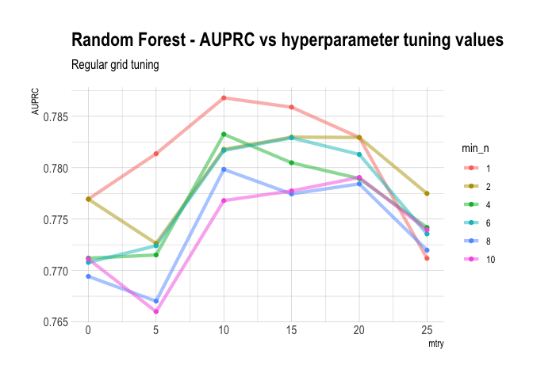
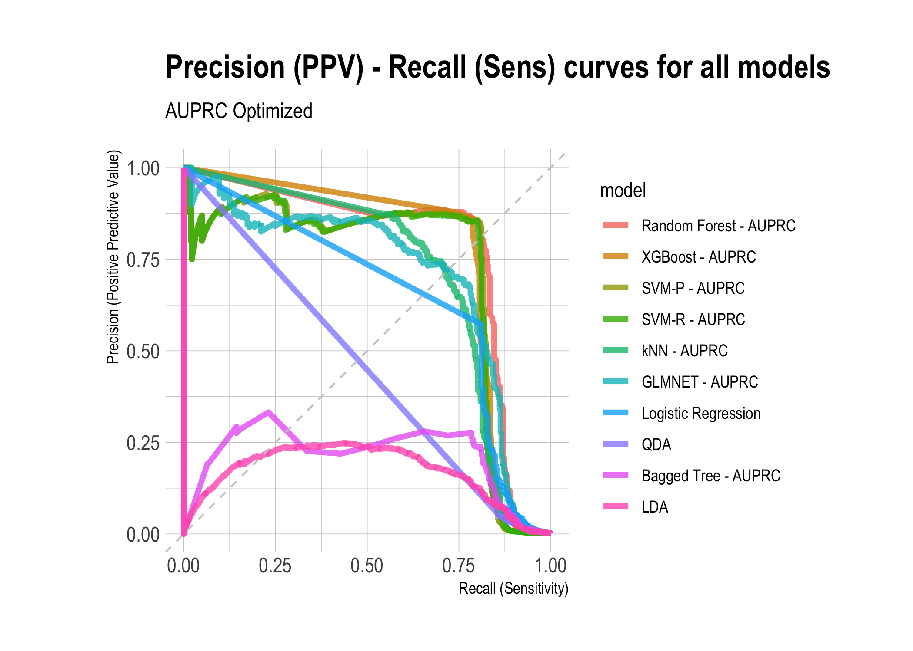
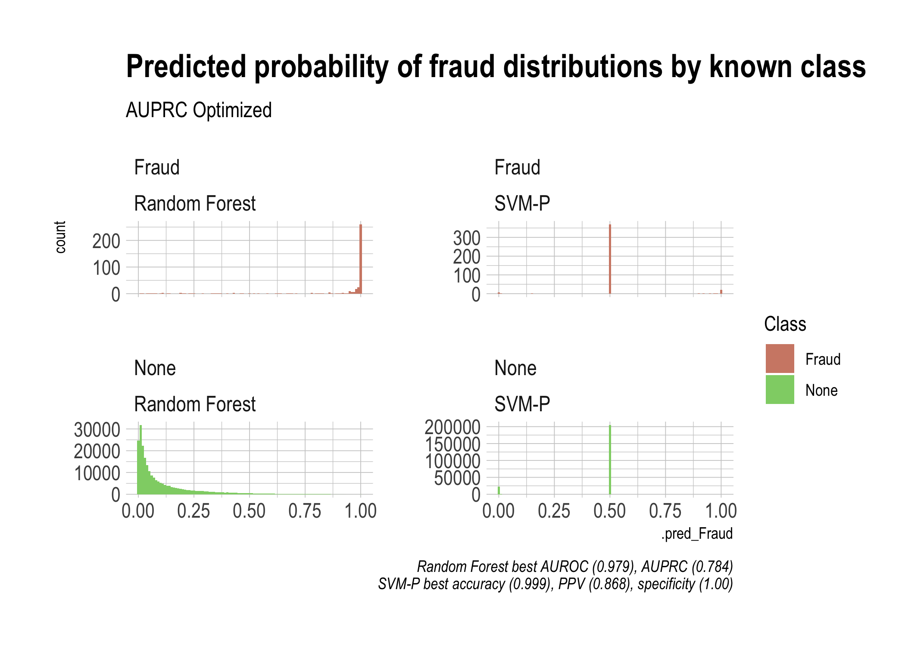
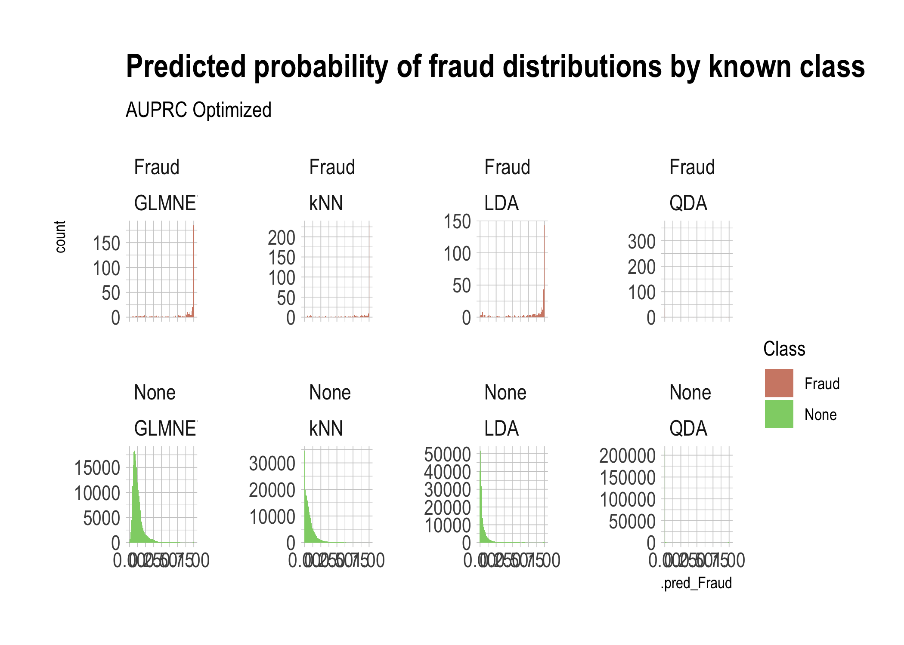
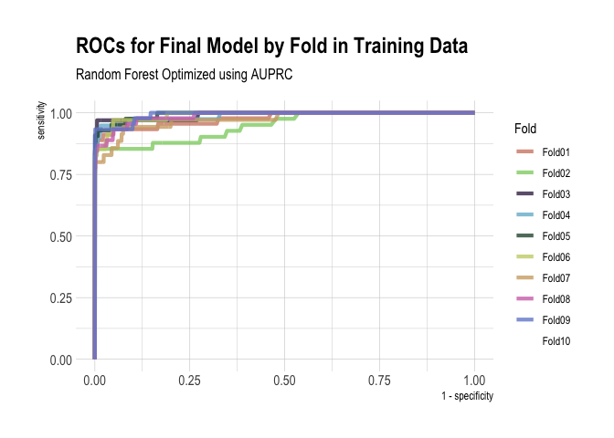

```r
# Set Up ------------------------------------------------------------------
```

```r
knitr::opts_chunk$set(warning=FALSE, message = FALSE)
```

```r
library(tidyverse)
library(tidymodels)
library(baguette)
library(themis)
library(vip)
library(kknn)
library(discrim)
library(here)
library(kableExtra)
library(hrbrthemes)
library(janitor)
library(skimr)
```

```r
RNGkind(sample.kind = "Rounding")
set.seed(1)
```

```r
theme_set(theme_ipsum())
```

```r
credit <- as_tibble(read_csv(here("data", "creditcard.csv")))
```

```r
credit <- credit %>%
  mutate(
    log_amount = log(Amount + 1),
    Class = case_when(
      Class == 0 ~ "None",
      Class == 1 ~ "Fraud"
    )
  ) %>%
  mutate(across(.cols = Class, .fns = factor)) %>%
  dplyr::select(-Amount)
```

```r
tabyl(credit$Class)
```

```
##  credit$Class      n     percent
##         Fraud    492 0.001727486
##          None 284315 0.998272514
```

```r
levels(credit$Class)
```

```
## [1] "Fraud" "None"
```

```r
# Pre-Processing ----------------------------------------------------------
```


Because there's a severe class imbalance, we should use subsampling (either oversampling or undersampling).
Subsampling has a few important points regarding the [workflow](https://www.tidymodels.org/learn/models/sub-sampling/):
- It is extremely important that subsampling occurs inside of resampling. Otherwise, the resampling process can produce poor estimates of model performance.
- The subsampling process should only be applied to the analysis set. The assessment set should reflect the event rates seen “in the wild” and, for this reason, the skip argument to step_downsample() and other subsampling recipes steps has a default of TRUE.


```r
set.seed(1234)
credit_split <- initial_split(credit, strata = "Class", prop = 0.8)
```

```r
credit_train <- training(credit_split)
credit_test <- testing(credit_split)
```

```r
tabyl(credit_train$Class)
```

```
##  credit_train$Class      n     percent
##               Fraud    403 0.001768739
##                None 227443 0.998231261
```

```r
tabyl(credit_test$Class)
```

```
##  credit_test$Class     n     percent
##              Fraud    89 0.001562473
##               None 56872 0.998437527
```

```r
# Create fold so same folds analyzed for every method
set.seed(1234)
credit_folds <- vfold_cv(credit_train, v = 10)
```

```r
# Create recipe so all folds are undergo same pre-processing
credit_rec <-
  recipe(Class ~ ., data = credit_train) %>%
  step_dummy(all_nominal(), -all_outcomes()) %>%
  step_zv(all_numeric()) %>%
  step_normalize(Time, log_amount) %>%
  step_downsample(Class)
```

```r
# Create workflow so all models can replicate same analysis methods
credit_wf <- workflow() %>%
  add_recipe(credit_rec)
```

```r
# Create list of metrics to record in model fits
model_mets <- metric_set(
  roc_auc, accuracy, sensitivity, specificity, j_index,
  ppv, npv, pr_auc
)
```

# Linear Models
## Logistic Regression


```r
# Logistic Regression -----------------------------------------------------
```

```r
# Specify logistic model
glm_spec <- logistic_reg() %>%
  set_engine("glm")
```

```r
# Fit logistic model to all folds in training data (resampling), saving certain metrics
# doParallel::registerDoParallel()
# glm_rs <- credit_wf %>%
#   add_model(glm_spec) %>%
#   fit_resamples(
#     resamples = credit_folds,
#     metrics = model_mets,
#     control = control_resamples(save_pred = TRUE)
#   )
# 
# saveRDS(glm_rs, here("out", "glm_rs.rds"))
glm_rs <- readRDS(here("out", "glm_rs.rds"))
```

```r
# Examine which variables are most important
glm_spec %>%
  set_engine("glm") %>%
  fit(Class ~ .,
    data = juice(prep(credit_rec))
  ) %>%
  vip(geom = "point") +
  labs(title = "Logistic Regression VIP")
```

<!-- -->

```r
ggsave(plot = last_plot(), path = here("out"), filename = "glm-vip.png")
```

```r
# Create ROC curve
glm_roc <- glm_rs %>%
  collect_predictions() %>%
  roc_curve(truth = Class, .pred_Fraud) %>%
  mutate(model = "Logistic Regression")
```

```r
# Create Precision-Recall curve (PPV-Sensitivity)
glm_prc <- glm_rs %>%
  collect_predictions() %>%
  pr_curve(truth = Class, .pred_Fraud) %>%
  mutate(model = "Logistic Regression")
```

```r
# Create tibble of metrics
glm_met <- glm_rs %>%
  collect_metrics() %>%
  mutate(model = "Logistic Regression")
```

## GLMNET


```r
# GLMNET ------------------------------------------------------------------
```

```r
# Specify GLMNET model
glmnet_spec <- logistic_reg(
  penalty = tune(),
  mixture = tune()
) %>%
  set_engine("glmnet")
```

```r
# Create grid to tune penalty and mixture (Lasso vs Ridge)
glmnet_grid <- grid_latin_hypercube(
  penalty(),
  mixture(),
  size = 20
)
```

```r
# Tune GLMNET hyperparameters
# doParallel::registerDoParallel()
# set.seed(1234)
# glmnet_tune_rs <- tune_grid(
#   credit_wf %>% add_model(glmnet_spec),
#   resamples = credit_folds,
#   metrics = model_mets,
#   grid = glmnet_grid
# )
# 
# saveRDS(glmnet_tune_rs, file = here("out", "glmnet_tune_rs.rds"))
glmnet_tune_rs <- readRDS(here("out", "glmnet_tune_rs.rds"))
```

```r
# Examine AUROC for hyperparameters
glmnet_tune_rs %>%
  collect_metrics() %>%
  filter(.metric == "roc_auc") %>%
  dplyr::select(mean, penalty, mixture) %>%
  pivot_longer(
    penalty:mixture,
    names_to = "parameter",
    values_to = "value"
  ) %>%
  ggplot(aes(x = value, y = mean, color = parameter)) +
  geom_point() +
  labs(
    y = "AUC",
    title = "GLMNET - AUROC vs hyperparameter tuning values",
    subtitle = "LHS grid tuning"
  ) +
  facet_wrap(~parameter, scales = "free_x")
```

<!-- -->

```r
ggsave(plot = last_plot(), path = here("out"), filename = "glmnet-auroc-tune.png")
```

```r
# Examine AUPRC for hyperparameters
glmnet_tune_rs %>%
  collect_metrics() %>%
  filter(.metric == "pr_auc") %>%
  dplyr::select(mean, penalty, mixture) %>%
  pivot_longer(
    penalty:mixture,
    names_to = "parameter",
    values_to = "value"
  ) %>%
  ggplot(aes(x = value, y = mean, color = parameter)) +
  geom_point() +
  labs(
    y = "AUPRC",
    title = "GLMNET - AUPRC vs hyperparameter tuning values",
    subtitle = "LHS grid tuning"
  ) +
  facet_wrap(~parameter, scales = "free_x")
```

<!-- -->

```r
ggsave(plot = last_plot(), path = here("out"), filename = "glmnet-auprc-tune.png")
```

```r
# Save best hyperparameters based on AUROC and AUPRC
best_glmnet_auroc <- select_best(glmnet_tune_rs, metric = "roc_auc")
best_glmnet_auprc <- select_best(glmnet_tune_rs, metric = "pr_auc")
```

```r
# Specify optimized GLMNET model - AUROC optimized
glmnet_final_auroc_spec <- finalize_model(
  glmnet_spec,
  best_glmnet_auroc
)
```

```r
# Specify optimized GLMNET model - AUPRC optimized
glmnet_final_auprc_spec <- finalize_model(
  glmnet_spec,
  best_glmnet_auprc
)
```

```r
# Examine which variables are most important in AUROC optimized
glmnet_final_auroc_spec %>%
  set_engine("glmnet", importance = "permutation") %>%
  fit(Class ~ .,
      data = juice(prep(credit_rec))
  ) %>%
  vip(geom = "point") +
  labs(title = "GLMNET AUROC VIP")
```

<!-- -->

```r
ggsave(plot = last_plot(), path = here("out"), filename = "glmnet-final-auroc-vip.png")
```

```r
# Examine which variables are most important in AUPRC optimized
glmnet_final_auprc_spec %>%
  set_engine("glmnet", importance = "permutation") %>%
  fit(Class ~ .,
      data = juice(prep(credit_rec))
  ) %>%
  vip(geom = "point") +
  labs(title = "GLMNET AUPRC VIP")
```

<!-- -->

```r
ggsave(plot = last_plot(), path = here("out"), filename = "glmnet-final-auprc-vip.png")
```

```r
# Fit GLMNET model to all folds in training data (resampling), saving certain metrics - AUROC optimized
# glmnet_final_auroc_rs <- credit_wf %>%
#   add_model(glmnet_final_auroc_spec) %>%
#   fit_resamples(
#     resamples = credit_folds,
#     metrics = model_mets,
#     control = control_resamples(save_pred = TRUE)
#   )
# 
# saveRDS(glmnet_final_auroc_rs, file = here("out", "glmnet_final_auroc_rs.rds"))
glmnet_final_auroc_rs <- readRDS(here("out", "glmnet_final_auroc_rs.rds"))
```

```r
# Fit GLMNET model to all folds in training data (resampling), saving certain metrics - AUPRC optimized
# glmnet_final_auprc_rs <- credit_wf %>%
#   add_model(glmnet_final_auprc_spec) %>%
#   fit_resamples(
#     resamples = credit_folds,
#     metrics = model_mets,
#     control = control_resamples(save_pred = TRUE)
#   )
# 
# saveRDS(glmnet_final_auprc_rs, file = here("out", "glmnet_final_auprc_rs.rds"))
glmnet_final_auprc_rs <- readRDS(here("out", "glmnet_final_auprc_rs.rds"))
```

```r
# Create ROC curve - AUROC optimized
glmnet_final_auroc_roc <- glmnet_final_auroc_rs %>%
  collect_predictions() %>%
  roc_curve(truth = Class, .pred_Fraud) %>%
  mutate(model = "GLMNET - AUROC")
```

```r
# Create Precision-Recall curve (PPV-Sensitivity) - AUROC optimized
glmnet_final_auroc_prc <- glmnet_final_auroc_rs %>%
  collect_predictions() %>%
  pr_curve(truth = Class, .pred_Fraud) %>%
  mutate(model = "GLMNET - AUROC")
```

```r
# Create tibble of metrics - AUROC optimized
glmnet_final_auroc_met <- glmnet_final_auroc_rs %>%
  collect_metrics() %>%
  mutate(model = "GLMNET - AUROC")
```

```r
# Create ROC curve - AUPRC optimized
glmnet_final_auprc_roc <- glmnet_final_auprc_rs %>%
  collect_predictions() %>%
  roc_curve(truth = Class, .pred_Fraud) %>%
  mutate(model = "GLMNET - AUPRC")
```

```r
# Create Precision-Recall curve (PPV-Sensitivity) - AUPRC optimized
glmnet_final_auprc_prc <- glmnet_final_auprc_rs %>%
  collect_predictions() %>%
  pr_curve(truth = Class, .pred_Fraud) %>%
  mutate(model = "GLMNET - AUPRC")
```

```r
# Create tibble of metrics - AUPRC optimized
glmnet_final_auprc_met <- glmnet_final_auprc_rs %>%
  collect_metrics() %>%
  mutate(model = "GLMNET - AUPRC")
```

# Discriminant Analysis
## LDA


```r
# LDA ---------------------------------------------------------------------
```

```r
# Specify LDA model
lda_spec <- discrim_linear() %>%
  set_engine("MASS")
```

```r
# Fit logistic model to all folds in training data (resampling), saving certain metrics
# doParallel::registerDoParallel()
# lda_rs <- credit_wf %>%
#   add_model(lda_spec) %>%
#   fit_resamples(
#     resamples = credit_folds,
#     metrics = model_mets,
#     control = control_resamples(save_pred = TRUE)
#   )
#
# saveRDS(lda_rs, here("out", "lda_rs.rds"))
lda_rs <- readRDS(here("out", "lda_rs.rds"))
```

```r
# Create ROC curve
lda_roc <- lda_rs %>%
  collect_predictions() %>%
  roc_curve(truth = Class, .pred_Fraud) %>%
  mutate(model = "LDA")
```

```r
# Create Precision-Recall curve (PPV-Sensitivity)
lda_prc <- lda_rs %>%
  collect_predictions() %>%
  pr_curve(truth = Class, .pred_Fraud) %>%
  mutate(model = "LDA")
```

```r
# Create tibble of metrics
lda_met <- lda_rs %>%
  collect_metrics() %>%
  mutate(model = "LDA")
```

## QDA


```r
# QDA ---------------------------------------------------------------------
```

```r
qda_spec <- discrim_regularized(frac_common_cov = 0, frac_identity = 0) %>%
  set_engine("klaR")
```

```r
# Fit QDA model to all folds in training data (resampling), saving certain metrics
# doParallel::registerDoParallel()
# qda_rs <- credit_wf %>%
#   add_model(qda_spec) %>%
#   fit_resamples(
#     resamples = credit_folds,
#     metrics = model_mets,
#     control = control_resamples(save_pred = TRUE)
#   )
# 
# saveRDS(qda_rs, here("out", "qda_rs.rds"))
qda_rs <- readRDS(here("out", "qda_rs.rds"))
```

```r
# Create ROC curve
qda_roc <- qda_rs %>%
  collect_predictions() %>%
  roc_curve(truth = Class, .pred_Fraud) %>%
  mutate(model = "QDA")
```

```r
# Create Precision-Recall curve (PPV-Sensitivity)
qda_prc <- qda_rs %>%
  collect_predictions() %>%
  pr_curve(truth = Class, .pred_Fraud) %>%
  mutate(model = "QDA")
```

```r
# Create tibble of metrics
qda_met <- qda_rs %>%
  collect_metrics() %>%
  mutate(model = "QDA")
```

# Tree Based Methods
## Random Forest


```r
# Random Forest -----------------------------------------------------------
```

```r
# Specify random forest model
rf_spec <- rand_forest(
  mtry = tune(),
  trees = 500,
  min_n = tune()
) %>%
  set_engine("ranger") %>%
  set_mode("classification")
```

```r
# Tune random forest hyperparameters
# doParallel::registerDoParallel()
# set.seed(1234)
# rf_tune_rs <- tune_grid(
#   credit_wf %>% add_model(rf_spec),
#   resamples = credit_folds,
#   metrics = model_mets,
#   grid = 20
# )
# 
# saveRDS(rf_tune_rs, file = here("out", "rf_tune_rs.rds"))
rf_tune_rs <- readRDS(here("out", "rf_tune_rs.rds"))
```

```r
rf_tune_rs %>%
  collect_metrics() %>%
  filter(.metric == "roc_auc") %>%
  dplyr::select(mean, min_n, mtry) %>%
  pivot_longer(
    cols = min_n:mtry,
    values_to = "value",
    names_to = "parameter"
  ) %>%
  ggplot(aes(x = value, y = mean, color = parameter)) +
  geom_point(show.legend = FALSE) +
  facet_wrap(~parameter, scales = "free_x") +
  labs(
    x = NULL, y = "AUROC",
    title = "Random Forest - AUROC vs hyperparameter tuning values",
    subtitle = "Initial tuning"
  )
```

<!-- -->

```r
ggsave(plot = last_plot(), path = here("out"), filename = "rf-initial-auroc-tune.png")
```

```r
rf_tune_rs %>%
  collect_metrics() %>%
  filter(.metric == "pr_auc") %>%
  dplyr::select(mean, min_n, mtry) %>%
  pivot_longer(
    cols = min_n:mtry,
    values_to = "value",
    names_to = "parameter"
  ) %>%
  ggplot(aes(x = value, y = mean, color = parameter)) +
  geom_point(show.legend = FALSE) +
  facet_wrap(~parameter, scales = "free_x") +
  labs(
    x = NULL, y = "AUPRC",
    title = "Random Forest - AUPRC vs hyperparameter tuning values",
    subtitle = "Initial tuning"
  )
```

<!-- -->

```r
ggsave(plot = last_plot(), path = here("out"), filename = "rf-initial-auprc-tune.png")
```

We can see that lower values of `min_n` are better, and no pattern with `mtry`
with respect to AUROC. For AUPRC, mtry seems optimized between 10 and 25.
Let's create a regular grid to do a finer optimization.


```r
rf_grid <- grid_regular(
  mtry(range = c(0, 25)),
  min_n(range = c(1, 10)),
  levels = 6
)

rf_grid
```

```
## # A tibble: 36 x 2
##     mtry min_n
##    <int> <int>
##  1     0     1
##  2     5     1
##  3    10     1
##  4    15     1
##  5    20     1
##  6    25     1
##  7     0     2
##  8     5     2
##  9    10     2
## 10    15     2
## # … with 26 more rows
```

```r
# Fit Random Forest with regular tuning grid that is more focussed
# doParallel::registerDoParallel()
# set.seed(1234)
# rf_reg_tune_rs <- tune_grid(
#   credit_wf %>% add_model(rf_spec),
#   resamples = credit_folds,
#   metrics = model_mets,
#   grid = rf_grid
# )
# 
# saveRDS(rf_reg_tune_rs, file = here("out", "rf_reg_tune_rs.rds"))
rf_reg_tune_rs <- readRDS(here("out", "rf_reg_tune_rs.rds"))
```

```r
# Examine AUROC for hyperparameters
rf_reg_tune_rs %>%
  collect_metrics() %>%
  filter(.metric == "roc_auc") %>%
  mutate(min_n = factor(min_n)) %>%
  ggplot(aes(x = mtry, y = mean, color = min_n)) +
  geom_line(alpha = 0.5, size = 1.5) +
  geom_point() +
  labs(
    y = "AUROC",
    title = "Random Forest - AUROC vs hyperparameter tuning values",
    subtitle = "Regular grid tuning"
  )
```

<!-- -->

```r
ggsave(plot = last_plot(), path = here("out"), filename = "rf-grid-auroc-tune.png")
```

```r
# Examine AUPRC for hyperparameters
rf_reg_tune_rs %>%
  collect_metrics() %>%
  filter(.metric == "pr_auc") %>%
  mutate(min_n = factor(min_n)) %>%
  ggplot(aes(x = mtry, y = mean, color = min_n)) +
  geom_line(alpha = 0.5, size = 1.5) +
  geom_point() +
  labs(
    y = "AUPRC",
    title = "Random Forest - AUPRC vs hyperparameter tuning values",
    subtitle = "Regular grid tuning"
  )
```

<!-- -->

```r
ggsave(plot = last_plot(), path = here("out"), filename = "rf-grid-auprc-tune.png")
```

```r
# Examine accuracy for hyperparameters
rf_reg_tune_rs %>%
  collect_metrics() %>%
  filter(.metric == "accuracy") %>%
  mutate(min_n = factor(min_n)) %>%
  ggplot(aes(x = mtry, y = mean, color = min_n)) +
  geom_line(alpha = 0.5, size = 1.5) +
  geom_point() +
  labs(
    y = "Accuracy",
    title = "Random Forest - Accuracy vs hyperparameter tuning values",
    subtitle = "Regular grid tuning"
  )
```

<!-- -->

```r
ggsave(plot = last_plot(), path = here("out"), filename = "rf-grid-acc-tune.png")
```

We can see from the plot of AUROC and AUPRC that the best combination is `min_n = 1`, 
and `mtry = 10`. There seems to be a decline in accuracy from `mtry = 5`, however,
this is likely due to reduced sensitivity and improved specificity, which is
the opposite of what we're interested in given the class imbalance.
It is generally accepted that good starting points are `mtry = sqrt(p)` (c. 5)
and `min_n = 1` for classification models (https://bradleyboehmke.github.io/HOML/random-forest.html)


```r
# Save best hyperparameters based on AUROC and AUPRC
best_rf_auroc <- select_best(rf_reg_tune_rs, "roc_auc")
best_rf_auprc <- select_best(rf_reg_tune_rs, "pr_auc")
```

```r
# Specify optimized RF model - AUROC optimized
rf_final_auroc_spec <- finalize_model(
  rf_spec,
  best_rf_auroc
)
```

```r
# Specify optimized RF model - AUPRC optimized
rf_final_auprc_spec <- finalize_model(
  rf_spec,
  best_rf_auprc
)
```

```r
# Examine which variables are most important - AUROC optimized
set.seed(1234)
rf_final_auroc_spec %>%
  set_engine("ranger", importance = "permutation") %>%
  fit(Class ~ .,
    data = juice(prep(credit_rec))
  ) %>%
  vip(geom = "point") +
  labs(title = "Random Forest AUROC VIP")
```

<!-- -->

```r
ggsave(plot = last_plot(), path = here("out"), filename = "rf-final-auroc-vip.png")
```

```r
# Examine which variables are most important - AUPRC optimized
set.seed(1234)
rf_final_auprc_spec %>%
  set_engine("ranger", importance = "permutation") %>%
  fit(Class ~ .,
      data = juice(prep(credit_rec))
  ) %>%
  vip(geom = "point") +
  labs(title = "Random Forest AUPRC VIP")
```

<!-- -->

```r
ggsave(plot = last_plot(), path = here("out"), filename = "rf-final-auprc-vip.png")
```

Important to note that PCA is unsupervised so only looks at relevance to the
variance observed in the predictors, not at their relevance to the outcome,
so not necessary that PC1 would be the most important PC in predicting Class


```r
# Fit random forest model to all folds in training data (resampling), saving certain metrics - AUROC optimized
# rf_final_auroc_rs <- credit_wf %>%
#   add_model(rf_final_auroc_spec) %>%
#   fit_resamples(
#     resamples = credit_folds,
#     metrics = model_mets,
#     control = control_resamples(save_pred = TRUE)
#   )
# 
# saveRDS(rf_final_auroc_rs, file = here("out", "rf_final_auroc_rs.rds"))
rf_final_auroc_rs <- readRDS(here("out", "rf_final_auroc_rs.rds"))
```

```r
# Fit random forest model to all folds in training data (resampling), saving certain metrics - AUPRC optimized
# rf_final_auprc_rs <- credit_wf %>%
#   add_model(rf_final_auprc_spec) %>%
#   fit_resamples(
#     resamples = credit_folds,
#     metrics = model_mets,
#     control = control_resamples(save_pred = TRUE)
#   )
# 
# saveRDS(rf_final_auprc_rs, file = here("out", "rf_final_auprc_rs.rds"))
rf_final_auprc_rs <- readRDS(here("out", "rf_final_auprc_rs.rds"))
```

```r
# Create ROC curve - AUROC optimized
rf_final_auroc_roc <- rf_final_auroc_rs %>%
  collect_predictions() %>%
  roc_curve(truth = Class, .pred_Fraud) %>%
  mutate(model = "Random Forest - AUROC")
```

```r
# Create Precision-Recall curve (PPV-Sensitivity) - AUROC optimized
rf_final_auroc_prc <- rf_final_auroc_rs %>%
  collect_predictions() %>%
  pr_curve(truth = Class, .pred_Fraud) %>%
  mutate(model = "Random Forest - AUROC")
```

```r
# Create tibble of metrics - AUROC optimized
rf_final_auroc_met <- rf_final_auroc_rs %>%
  collect_metrics() %>%
  mutate(model = "Random Forest - AUROC")
```

```r
# Create ROC curve - AUPRC optimized
rf_final_auprc_roc <- rf_final_auprc_rs %>%
  collect_predictions() %>%
  roc_curve(truth = Class, .pred_Fraud) %>%
  mutate(model = "Random Forest - AUPRC")
```

```r
# Create Precision-Recall curve (PPV-Sensitivity) - AUPRC optimized
rf_final_auprc_prc <- rf_final_auprc_rs %>%
  collect_predictions() %>%
  pr_curve(truth = Class, .pred_Fraud) %>%
  mutate(model = "Random Forest - AUPRC")
```

```r
# Create tibble of metrics - AUPRC optimized
rf_final_auprc_met <- rf_final_auprc_rs %>%
  collect_metrics() %>%
  mutate(model = "Random Forest - AUPRC")
```

## XGBoost


```r
# XGBoost -----------------------------------------------------------------
```

```r
# Specify boosted tree model
xgb_spec <- boost_tree(
  trees = 500,
  tree_depth = tune(),
  min_n = tune(),
  loss_reduction = tune(),
  sample_size = tune(),
  mtry = tune(),
  learn_rate = tune()
) %>%
  set_engine("xgboost") %>%
  set_mode("classification")
```

```r
# Create space filling parameter latin hypercube grid - regular grid too slow
xgb_grid <- grid_latin_hypercube(
  tree_depth(),
  min_n(),
  loss_reduction(),
  sample_size = sample_prop(),
  finalize(mtry(), credit_train),
  learn_rate(),
  size = 20
)
```

```r
# Tune XGBoost hyperparameters using space filling parameter grid
# doParallel::registerDoParallel()
# set.seed(1234)
# xgb_tune_rs <- tune_grid(
#   credit_wf %>% add_model(xgb_spec),
#   resamples = credit_folds,
#   metrics = model_mets,
#   grid = xgb_grid
# )
# 
# saveRDS(xgb_tune_rs, file = here("out", "xgb_tune_rs.rds"))
xgb_tune_rs <- readRDS(here("out", "xgb_tune_rs.rds"))
```

```r
# Examine AUROC for hyperparameters
xgb_tune_rs %>%
  collect_metrics() %>%
  filter(.metric == "roc_auc") %>%
  dplyr::select(mean, mtry:sample_size) %>%
  pivot_longer(
    mtry:sample_size,
    names_to = "parameter",
    values_to = "value"
  ) %>%
  ggplot(aes(x = value, y = mean, color = parameter)) +
  geom_point() +
  labs(
    y = "AUROC",
    title = "XGBoost - AUROC vs hyperparameter tuning values",
    subtitle = "LHS grid tuning"
  ) +
  facet_wrap(~parameter, scales = "free_x")
```

<!-- -->

```r
ggsave(plot = last_plot(), path = here("out"), filename = "xgb-auroc-tune.png")
```

```r
# Examine AUPRC for hyperparameters
xgb_tune_rs %>%
  collect_metrics() %>%
  filter(.metric == "pr_auc") %>%
  dplyr::select(mean, mtry:sample_size) %>%
  pivot_longer(
    mtry:sample_size,
    names_to = "parameter",
    values_to = "value"
  ) %>%
  ggplot(aes(x = value, y = mean, color = parameter)) +
  geom_point() +
  labs(
    y = "AUPRC",
    title = "XGBoost - AUPRC vs hyperparameter tuning values",
    subtitle = "LHS grid tuning"
  ) +
  facet_wrap(~parameter, scales = "free_x")
```

<!-- -->

```r
ggsave(plot = last_plot(), path = here("out"), filename = "xgb-auprc-tune.png")
```

```r
show_best(xgb_tune_rs, "roc_auc")
```

```
## # A tibble: 5 x 12
##    mtry min_n tree_depth learn_rate loss_reduction sample_size .metric
##   <int> <int>      <int>      <dbl>          <dbl>       <dbl> <chr>  
## 1    31     2          9    4.07e-2   0.0395             0.750 roc_auc
## 2    15     5          4    2.26e-6   0.00000429         0.204 roc_auc
## 3    18    25         10    7.61e-8   0.00109            0.786 roc_auc
## 4    28    10         13    2.72e-4   2.34               0.351 roc_auc
## 5     4    17          7    7.62e-6   0.0000000594       0.552 roc_auc
## # … with 5 more variables: .estimator <chr>, mean <dbl>, n <int>,
## #   std_err <dbl>, .config <chr>
```

```r
show_best(xgb_tune_rs, "pr_auc")
```

```
## # A tibble: 5 x 12
##    mtry min_n tree_depth learn_rate loss_reduction sample_size .metric
##   <int> <int>      <int>      <dbl>          <dbl>       <dbl> <chr>  
## 1    23    25          8    7.12e-9       1.97e- 4       0.453 pr_auc 
## 2    27     9          2    2.83e-7       9.81e- 2       0.148 pr_auc 
## 3    16    30         15    5.28e-7       1.99e- 5       0.507 pr_auc 
## 4    13     7          4    8.56e-5       1.24e+ 1       0.886 pr_auc 
## 5    21    13          3    1.75e-2       3.07e-10       0.294 pr_auc 
## # … with 5 more variables: .estimator <chr>, mean <dbl>, n <int>,
## #   std_err <dbl>, .config <chr>
```

```r
# Save best hyperparameters based on AUROC and AUPRC
best_xgb_auroc <- select_best(xgb_tune_rs, "roc_auc")
best_xgb_auprc <- select_best(xgb_tune_rs, "pr_auc")
```

```r
# Specify optimized XGBoost model - AUROC optimized
xgb_final_auroc_spec <- finalize_model(
  xgb_spec,
  best_xgb_auroc
)
```

```r
# Specify optimized XGBoost model - AUPRC optimized
xgb_final_auprc_spec <- finalize_model(
  xgb_spec,
  best_xgb_auprc
)
```

```r
# Examine which variables are most important - AUROC optimized
set.seed(1234)
xgb_final_auroc_spec %>%
  set_engine("xgboost", importance = "permutation") %>%
  fit(Class ~ .,
    data = juice(prep(credit_rec))
  ) %>%
  vip(geom = "point") +
  labs(title = "XGBoost AUROC VIP")
```

```
## [16:52:30] WARNING: amalgamation/../src/learner.cc:516: 
## Parameters: { importance } might not be used.
## 
##   This may not be accurate due to some parameters are only used in language bindings but
##   passed down to XGBoost core.  Or some parameters are not used but slip through this
##   verification. Please open an issue if you find above cases.
```

<!-- -->

```r
ggsave(plot = last_plot(), path = here("out"), filename = "xgb-final-auroc-vip.png")
```

```r
# Examine which variables are most important - AUPRC optimized
set.seed(1234)
xgb_final_auprc_spec %>%
  set_engine("xgboost", importance = "permutation") %>%
  fit(Class ~ .,
      data = juice(prep(credit_rec))
  ) %>%
  vip(geom = "point") +
  labs(title = "XGBoost AUPRC VIP")
```

```
## [16:52:34] WARNING: amalgamation/../src/learner.cc:516: 
## Parameters: { importance } might not be used.
## 
##   This may not be accurate due to some parameters are only used in language bindings but
##   passed down to XGBoost core.  Or some parameters are not used but slip through this
##   verification. Please open an issue if you find above cases.
```

<!-- -->

```r
ggsave(plot = last_plot(), path = here("out"), filename = "xgb-final-auprc-vip.png")
```

```r
# Fit XGBoost model to all folds in training data (resampling), saving certain metrics - AUROC optimized
# xgb_final_auroc_rs <- credit_wf %>%
#   add_model(xgb_final_auroc_spec) %>%
#   fit_resamples(
#     resamples = credit_folds,
#     metrics = model_mets,
#     control = control_resamples(save_pred = TRUE)
#   )
# 
# saveRDS(xgb_final_auroc_rs, file = here("out", "xgb_final_auroc_rs.rds"))
xgb_final_auroc_rs <- readRDS(here("out", "xgb_final_auroc_rs.rds"))
```

```r
# Fit XGBoost model to all folds in training data (resampling), saving certain metrics - AUPRC optimized
# xgb_final_auprc_rs <- credit_wf %>%
#   add_model(xgb_final_auprc_spec) %>%
#   fit_resamples(
#     resamples = credit_folds,
#     metrics = model_mets,
#     control = control_resamples(save_pred = TRUE)
#   )
# 
# saveRDS(xgb_final_auprc_rs, file = here("out", "xgb_final_auprc_rs.rds"))
xgb_final_auprc_rs <- readRDS(here("out", "xgb_final_auprc_rs.rds"))
```

```r
# Create ROC curve - AUROC optimized
xgb_final_auroc_roc <- xgb_final_auroc_rs %>%
  collect_predictions() %>%
  roc_curve(truth = Class, .pred_Fraud) %>%
  mutate(model = "XGBoost - AUROC")
```

```r
# Create Precision-Recall curve (PPV-Sensitivity) - AUROC optimized
xgb_final_auroc_prc <- xgb_final_auroc_rs %>%
  collect_predictions() %>%
  pr_curve(truth = Class, .pred_Fraud) %>%
  mutate(model = "XGBoost - AUROC")
```

```r
# Create tibble of metrics - AUROC optimized
xgb_final_auroc_met <- xgb_final_auroc_rs %>%
  collect_metrics() %>%
  mutate(model = "XGBoost - AUROC")
```

```r
# Create ROC curve - AUPRC optimized
xgb_final_auprc_roc <- xgb_final_auprc_rs %>%
  collect_predictions() %>%
  roc_curve(truth = Class, .pred_Fraud) %>%
  mutate(model = "XGBoost - AUPRC")
```

```r
# Create Precision-Recall curve (PPV-Sensitivity) - AUPRC optimized
xgb_final_auprc_prc <- xgb_final_auprc_rs %>%
  collect_predictions() %>%
  pr_curve(truth = Class, .pred_Fraud) %>%
  mutate(model = "XGBoost - AUPRC")
```

```r
# Create tibble of metrics - AUPRC optimized
xgb_final_auprc_met <- xgb_final_auprc_rs %>%
  collect_metrics() %>%
  mutate(model = "XGBoost - AUPRC")
```

## Bagged Tree


```r
# Bagged Tree -------------------------------------------------------------
```

```r
# Specify bagged tree model
bag_spec <- bag_tree(
  cost_complexity = tune(),
  tree_depth = tune(),
  min_n = tune()
) %>%
  set_engine("rpart") %>%
  set_mode("classification")
```

```r
# Create space filling parameter latin hypercube grid - regular grid too slow
bag_grid <- grid_latin_hypercube(
  cost_complexity(),
  tree_depth(),
  min_n(),
  size = 20
)
```

```r
# Tune bagged tree hyperparameters using space filling parameter grid
# doParallel::registerDoParallel()
# set.seed(1234)
# bag_tune_rs <- tune_grid(
#   credit_wf %>% add_model(bag_spec),
#   resamples = credit_folds,
#   metrics = model_mets,
#   grid = bag_grid
# )
# 
# saveRDS(bag_tune_rs, file = here("out", "bag_tune_rs.rds"))
bag_tune_rs <- readRDS(here("out", "bag_tune_rs.rds"))
```

```r
# Examine AUROC for hyperparameters
bag_tune_rs %>%
  collect_metrics() %>%
  filter(.metric == "roc_auc") %>%
  dplyr::select(mean, cost_complexity:min_n) %>%
  pivot_longer(
    cost_complexity:min_n,
    names_to = "parameter",
    values_to = "value"
  ) %>%
  ggplot(aes(x = value, y = mean, color = parameter)) +
  geom_point() +
  labs(
    y = "AUROC",
    title = "Bagged Tree - AUROC vs hyperparameter tuning values",
    subtitle = "LHS grid tuning"
  ) +
  facet_wrap(~parameter, scales = "free_x")
```

<!-- -->

```r
ggsave(plot = last_plot(), path = here("out"), filename = "bag-auroc-tune.png")
```

```r
# Examine AUPRC for hyperparameters
bag_tune_rs %>%
  collect_metrics() %>%
  filter(.metric == "pr_auc") %>%
  dplyr::select(mean, cost_complexity:min_n) %>%
  pivot_longer(
    cost_complexity:min_n,
    names_to = "parameter",
    values_to = "value"
  ) %>%
  ggplot(aes(x = value, y = mean, color = parameter)) +
  geom_point() +
  labs(
    y = "AUPRC",
    title = "Bagged Tree - AUPRC vs hyperparameter tuning values",
    subtitle = "LHS grid tuning"
  ) +
  facet_wrap(~parameter, scales = "free_x")
```

<!-- -->

```r
ggsave(plot = last_plot(), path = here("out"), filename = "bag-auprc-tune.png")
```

```r
# Save best hyperparameters based on AUROC and AUPRC
best_bag_auroc <- select_best(bag_tune_rs, "roc_auc")
best_bag_auprc <- select_best(bag_tune_rs, "pr_auc")
```

```r
# Specify optimized bagged tree model - AUROC optimized
bag_final_auroc_spec <- finalize_model(
  bag_spec,
  best_bag_auroc
)
```

```r
# Specify optimized bagged tree model - AUPRC optimized
bag_final_auprc_spec <- finalize_model(
  bag_spec,
  best_bag_auprc
)
```

```r
# Examine which variables are most important - AUROC optimized
set.seed(1234)
bag_auroc_imp <- bag_final_auroc_spec %>%
  set_engine("rpart") %>%
  fit(Class ~ .,
    data = juice(prep(credit_rec))
  )
```

```r
bag_auroc_imp$fit$imp %>%
  mutate(term = fct_reorder(term, value)) %>%
  head(10) %>%
  ggplot(aes(x = value, y = term)) +
  geom_point() +
  labs(title = "Bagged Tree AUROC VIP")
```

<!-- -->

```r
ggsave(plot = last_plot(), path = here("out"), filename = "bag-final-auroc-vip.png")
```

```r
# Examine which variables are most important - AUPRC optimized
set.seed(1234)
bag_auprc_imp <- bag_final_auprc_spec %>%
  set_engine("rpart") %>%
  fit(Class ~ .,
      data = juice(prep(credit_rec))
  )
```

```r
bag_auprc_imp$fit$imp %>%
  mutate(term = fct_reorder(term, value)) %>%
  head(10) %>%
  ggplot(aes(x = value, y = term)) +
  geom_point() +
  labs(title = "Bagged Tree AUPRC VIP")
```

<!-- -->

```r
ggsave(plot = last_plot(), path = here("out"), filename = "bag-final-auprc-vip.png")
```

```r
# Fit bagged tree model to all folds in training data (resampling), saving certain metrics - AUROC optimized
# bag_final_auroc_rs <- credit_wf %>%
#   add_model(bag_final_auroc_spec) %>%
#   fit_resamples(
#     resamples = credit_folds,
#     metrics = model_mets,
#     control = control_resamples(save_pred = TRUE)
#   )
# 
# saveRDS(bag_final_auroc_rs, file = here("out", "bag_final_auroc_rs.rds"))
bag_final_auroc_rs <- readRDS(here("out", "bag_final_auroc_rs.rds"))
```

```r
# Fit bagged tree model to all folds in training data (resampling), saving certain metrics - AUPRC optimized
# bag_final_auprc_rs <- credit_wf %>%
#   add_model(bag_final_auprc_spec) %>%
#   fit_resamples(
#     resamples = credit_folds,
#     metrics = model_mets,
#     control = control_resamples(save_pred = TRUE)
#   )
# 
# saveRDS(bag_final_auprc_rs, file = here("out", "bag_final_auprc_rs.rds"))
bag_final_auprc_rs <- readRDS(here("out", "bag_final_auprc_rs.rds"))
```

```r
# Create ROC curve - AUROC optimized
bag_final_auroc_roc <- bag_final_auroc_rs %>%
  collect_predictions() %>%
  roc_curve(truth = Class, .pred_Fraud) %>%
  mutate(model = "Bagged Tree - AUROC")
```

```r
# Create Precision-Recall curve (PPV-Sensitivity) - AUROC optimized
bag_final_auroc_prc <- bag_final_auroc_rs %>%
  collect_predictions() %>%
  pr_curve(truth = Class, .pred_Fraud) %>%
  mutate(model = "Bagged Tree - AUROC")
```

```r
# Create tibble of metrics - AUROC optimized
bag_final_auroc_met <- bag_final_auroc_rs %>%
  collect_metrics() %>%
  mutate(model = "Bagged Tree - AUROC")
```

```r
# Create ROC curve - AUPRC optimized
bag_final_auprc_roc <- bag_final_auprc_rs %>%
  collect_predictions() %>%
  roc_curve(truth = Class, .pred_Fraud) %>%
  mutate(model = "Bagged Tree - AUPRC")
```

```r
# Create Precision-Recall curve (PPV-Sensitivity) - AUPRC optimized
bag_final_auprc_prc <- bag_final_auprc_rs %>%
  collect_predictions() %>%
  pr_curve(truth = Class, .pred_Fraud) %>%
  mutate(model = "Bagged Tree - AUPRC")
```

```r
# Create tibble of metrics - AUPRC optimized
bag_final_auprc_met <- bag_final_auprc_rs %>%
  collect_metrics() %>%
  mutate(model = "Bagged Tree - AUPRC")
```

# SVM Methods
## SVM - Radial Kernel


```r
# SVM - Radial ------------------------------------------------------------
```

```r
# Specify SVM-Radial model
svmr_spec <- svm_rbf(
  cost = tune(),
  rbf_sigma = tune()
) %>%
  set_engine("kernlab") %>%
  set_mode("classification")
```

```r
svmr_grid <- grid_latin_hypercube(
  cost(),
  rbf_sigma(),
  size = 20
)
```

```r
# Tune SVM-Radial hyperparameters
# doParallel::registerDoParallel()
# set.seed(1234)
# svmr_tune_rs <- tune_grid(
#   credit_wf %>% add_model(svmr_spec),
#   resamples = credit_folds,
#   metrics = model_mets,
#   grid = svmr_grid
# )
# 
# saveRDS(svmr_tune_rs, file = here("out", "svmr_tune_rs.rds"))
svmr_tune_rs <- readRDS(here("out", "svmr_tune_rs.rds"))
```

```r
# Examine AUROC for hyperparameters
svmr_tune_rs %>%
  collect_metrics() %>%
  filter(.metric == "roc_auc") %>%
  dplyr::select(mean, cost, rbf_sigma) %>%
  pivot_longer(
    cost:rbf_sigma,
    names_to = "parameter",
    values_to = "value"
  ) %>%
  ggplot(aes(x = value, y = mean, color = parameter)) +
  geom_point() +
  labs(
    y = "AUROC",
    title = "SVM Radial - AUROC vs hyperparameter tuning values",
    subtitle = "LHS grid tuning"
  ) +
  facet_wrap(~parameter, scales = "free_x")
```

<!-- -->

```r
ggsave(plot = last_plot(), path = here("out"), filename = "svmr-auroc-tune.png")
```

```r
# Examine AUPRC for hyperparameters
svmr_tune_rs %>%
  collect_metrics() %>%
  filter(.metric == "pr_auc") %>%
  dplyr::select(mean, cost, rbf_sigma) %>%
  pivot_longer(
    cost:rbf_sigma,
    names_to = "parameter",
    values_to = "value"
  ) %>%
  ggplot(aes(x = value, y = mean, color = parameter)) +
  geom_point() +
  labs(
    y = "AUPRC",
    title = "SVM Radial - AUPRC vs hyperparameter tuning values",
    subtitle = "LHS grid tuning"
  ) +
  facet_wrap(~parameter, scales = "free_x")
```

<!-- -->

```r
ggsave(plot = last_plot(), path = here("out"), filename = "svmr-auprc-tune.png")
```

```r
# Save best hyperparameters based on AUROC and AUPRC
best_svmr_auroc <- select_best(svmr_tune_rs, metric = "roc_auc")
best_svmr_auprc <- select_best(svmr_tune_rs, metric = "pr_auc")
```

```r
# Specify optimized SVM-R model - AUROC optimized
svmr_final_auroc_spec <- finalize_model(
  svmr_spec,
  best_svmr_auroc
)
```

```r
# Specify optimized SVM-R model - AUPRC optimized
svmr_final_auprc_spec <- finalize_model(
  svmr_spec,
  best_svmr_auprc
)
```

```r
# Fit SVM-R model to all folds in training data (resampling), saving certain metrics - AUROC optimized
# svmr_final_auroc_rs <- credit_wf %>%
#   add_model(svmr_final_auroc_spec) %>%
#   fit_resamples(
#     resamples = credit_folds,
#     metrics = model_mets,
#     control = control_resamples(save_pred = TRUE)
#   )
# 
# saveRDS(svmr_final_auroc_rs, file = here("out", "svmr_final_auroc_rs.rds"))
svmr_final_auroc_rs <- readRDS(here("out", "svmr_final_auroc_rs.rds"))
```

```r
# Fit SVM-R model to all folds in training data (resampling), saving certain metrics - AUPRC optimized
# svmr_final_auprc_rs <- credit_wf %>%
#   add_model(svmr_final_auprc_spec) %>%
#   fit_resamples(
#     resamples = credit_folds,
#     metrics = model_mets,
#     control = control_resamples(save_pred = TRUE)
#   )
# 
# saveRDS(svmr_final_auprc_rs, file = here("out", "svmr_final_auprc_rs.rds"))
svmr_final_auprc_rs <- readRDS(here("out", "svmr_final_auprc_rs.rds"))
```

```r
# Create ROC curve - AUROC optimized
svmr_final_auroc_roc <- svmr_final_auroc_rs %>%
  collect_predictions() %>%
  roc_curve(truth = Class, .pred_Fraud) %>%
  mutate(model = "SVM-R - AUROC")
```

```r
# Create Precision-Recall curve (PPV-Sensitivity) - AUROC optimized
svmr_final_auroc_prc <- svmr_final_auroc_rs %>%
  collect_predictions() %>%
  pr_curve(truth = Class, .pred_Fraud) %>%
  mutate(model = "SVM-R - AUROC")
```

```r
# Create tibble of metrics - AUROC optimized
svmr_final_auroc_met <- svmr_final_auroc_rs %>%
  collect_metrics() %>%
  mutate(model = "SVM-R - AUROC")
```

```r
# Create ROC curve - AUPRC optimized
svmr_final_auprc_roc <- svmr_final_auprc_rs %>%
  collect_predictions() %>%
  roc_curve(truth = Class, .pred_Fraud) %>%
  mutate(model = "SVM-R - AUPRC")
```

```r
# Create Precision-Recall curve (PPV-Sensitivity) - AUPRC optimized
svmr_final_auprc_prc <- svmr_final_auprc_rs %>%
  collect_predictions() %>%
  pr_curve(truth = Class, .pred_Fraud) %>%
  mutate(model = "SVM-R - AUPRC")
```

```r
# Create tibble of metrics - AUPRC optimized
svmr_final_auprc_met <- svmr_final_auprc_rs %>%
  collect_metrics() %>%
  mutate(model = "SVM-R - AUPRC")
```

## SVM - Polynomial Kernel


```r
# SVM - Polynomial --------------------------------------------------------
```

```r
# Specify SVM-Polynomial model
svmp_spec <- svm_poly(
  cost = tune(),
  degree = tune(),
  scale_factor = tune()
) %>%
  set_engine("kernlab") %>%
  set_mode("classification")
```

```r
svmp_grid <- grid_latin_hypercube(
  cost(),
  degree(),
  scale_factor(),
  size = 20
)
```

```r
# Tune SVM-P hyperparameters
# doParallel::registerDoParallel()
# set.seed(1234)
# svmp_tune_rs <- tune_grid(
#   credit_wf %>% add_model(svmp_spec),
#   resamples = credit_folds,
#   metrics = model_mets,
#   grid = svmp_grid
# )
# 
# saveRDS(svmp_tune_rs, file = here("out", "svmp_tune_rs.rds"))
svmp_tune_rs <- readRDS(here("out", "svmp_tune_rs.rds"))
```

```r
# Examine AUROC for hyperparameters
svmp_tune_rs %>%
  collect_metrics() %>%
  filter(.metric == "roc_auc") %>%
  dplyr::select(mean, cost:scale_factor) %>%
  pivot_longer(
    cost:scale_factor,
    names_to = "parameter",
    values_to = "value"
  ) %>%
  ggplot(aes(x = value, y = mean, color = parameter)) +
  geom_point() +
  labs(
    y = "AUROC",
    title = "SVM Polynomial - AUROC vs hyperparameter tuning values",
    subtitle = "LHS grid tuning"
  ) +
  facet_wrap(~parameter, scales = "free_x")
```

<!-- -->

```r
ggsave(plot = last_plot(), path = here("out"), filename = "svmp-auroc-tune.png")
```

```r
# Examine AUROC for hyperparameters
svmp_tune_rs %>%
  collect_metrics() %>%
  filter(.metric == "pr_auc") %>%
  dplyr::select(mean, cost:scale_factor) %>%
  pivot_longer(
    cost:scale_factor,
    names_to = "parameter",
    values_to = "value"
  ) %>%
  ggplot(aes(x = value, y = mean, color = parameter)) +
  geom_point() +
  labs(
    y = "AUPRC",
    title = "SVM Polynomial - AUPRC vs hyperparameter tuning values",
    subtitle = "LHS grid tuning"
  ) +
  facet_wrap(~parameter, scales = "free_x")
```

<!-- -->

```r
ggsave(plot = last_plot(), path = here("out"), filename = "svmp-auprc-tune.png")
```

```r
# Save best hyperparameters based on AUROC and AUPRC
best_svmp_auroc <- select_best(svmp_tune_rs, metric = "roc_auc")
best_svmp_auprc <- select_best(svmp_tune_rs, metric = "pr_auc")
```

```r
# Specify optimized SVM-P model - AUROC optimized
svmp_final_auroc_spec <- finalize_model(
  svmp_spec,
  best_svmp_auroc
)
```

```r
# Specify optimized SVM-P model - AUPRC optimized
svmp_final_auprc_spec <- finalize_model(
  svmp_spec,
  best_svmp_auprc
)
```

```r
# Fit SVM-P model to all folds in training data (resampling), saving certain metrics - AUROC optimized
# svmp_final_auroc_rs <- credit_wf %>%
#   add_model(svmp_final_auroc_spec) %>%
#   fit_resamples(
#     resamples = credit_folds,
#     metrics = model_mets,
#     control = control_resamples(save_pred = TRUE)
#   )
# 
# saveRDS(svmp_final_auroc_rs, file = here("out", "svmp_final_auroc_rs.rds"))
svmp_final_auroc_rs <- readRDS(here("out", "svmp_final_auroc_rs.rds"))
```

```r
# Fit SVM-P model to all folds in training data (resampling), saving certain metrics - AUPRC optimized
# svmp_final_auprc_rs <- credit_wf %>%
#   add_model(svmp_final_auprc_spec) %>%
#   fit_resamples(
#     resamples = credit_folds,
#     metrics = model_mets,
#     control = control_resamples(save_pred = TRUE)
#   )
# 
# saveRDS(svmp_final_auprc_rs, file = here("out", "svmp_final_auprc_rs.rds"))
svmp_final_auprc_rs <- readRDS(here("out", "svmp_final_auprc_rs.rds"))
```

```r
# Create ROC curve - AUROC optimized
svmp_final_auroc_roc <- svmp_final_auroc_rs %>%
  collect_predictions() %>%
  roc_curve(truth = Class, .pred_Fraud) %>%
  mutate(model = "SVM-P - AUROC")
```

```r
# Create Precision-Recall curve (PPV-Sensitivity) - AUROC optimized
svmp_final_auroc_prc <- svmp_final_auroc_rs %>%
  collect_predictions() %>%
  pr_curve(truth = Class, .pred_Fraud) %>%
  mutate(model = "SVM-P - AUROC")
```

```r
# Create tibble of metrics - AUROC optimized
svmp_final_auroc_met <- svmp_final_auroc_rs %>%
  collect_metrics() %>%
  mutate(model = "SVM-P - AUROC")
```

```r
# Create ROC curve - AUPRC optimized
svmp_final_auprc_roc <- svmp_final_auprc_rs %>%
  collect_predictions() %>%
  roc_curve(truth = Class, .pred_Fraud) %>%
  mutate(model = "SVM-P - AUPRC")
```

```r
# Create Precision-Recall curve (PPV-Sensitivity) - AUPRC optimized
svmp_final_auprc_prc <- svmp_final_auprc_rs %>%
  collect_predictions() %>%
  pr_curve(truth = Class, .pred_Fraud) %>%
  mutate(model = "SVM-P - AUPRC")
```

```r
# Create tibble of metrics - AUPRC optimized
svmp_final_auprc_met <- svmp_final_auprc_rs %>%
  collect_metrics() %>%
  mutate(model = "SVM-P - AUPRC")
```

# kNN


```r
# kNN ---------------------------------------------------------------------
```

```r
# Specify kNN model
knn_spec <- nearest_neighbor(
  neighbors = tune()
) %>%
  set_engine("kknn") %>%
  set_mode("classification")
```

```r
knn_grid <- grid_regular(
  neighbors(range = c(1, 70)),
  levels = 51
)
```

```r
knn_grid
```

```
## # A tibble: 51 x 1
##    neighbors
##        <int>
##  1         1
##  2         2
##  3         3
##  4         5
##  5         6
##  6         7
##  7         9
##  8        10
##  9        12
## 10        13
## # … with 41 more rows
```

```r
# Tune kNN hyperparameters
# doParallel::registerDoParallel()
# set.seed(1234)
# knn_tune_rs <- tune_grid(
#   credit_wf %>% add_model(knn_spec),
#   resamples = credit_folds,
#   metrics = model_mets,
#   grid = knn_grid
# )
# 
# saveRDS(knn_tune_rs, file = here("out", "knn_tune_rs.rds"))
knn_tune_rs <- readRDS(here("out", "knn_tune_rs.rds"))
```

```r
# Examine AUROC for hyperparameters
knn_tune_rs %>%
  collect_metrics() %>%
  filter(.metric == "roc_auc") %>%
  dplyr::select(mean, neighbors) %>%
  ggplot(aes(x = neighbors, y = mean)) +
  geom_point() +
  labs(
    y = "AUROC",
    title = "kNN - AUROC vs hyperparameter tuning values",
    subtitle = "Regular grid tuning"
  )
```

<!-- -->

```r
ggsave(plot = last_plot(), path = here("out"), filename = "knn-auroc-tune.png")
```

```r
# Examine AUPRC for hyperparameters
knn_tune_rs %>%
  collect_metrics() %>%
  filter(.metric == "pr_auc") %>%
  dplyr::select(mean, neighbors) %>%
  ggplot(aes(x = neighbors, y = mean)) +
  geom_point() +
  labs(
    y = "AUPRC",
    title = "kNN - AUPRC vs hyperparameter tuning values",
    subtitle = "Regular grid tuning"
  )
```

<!-- -->

```r
ggsave(plot = last_plot(), path = here("out"), filename = "knn-auprc-tune.png")
```

```r
# Save best hyperparameters based on AUROC and AUPRC
best_knn_auroc <- select_best(knn_tune_rs, metric = "roc_auc")
best_knn_auprc <- select_best(knn_tune_rs, metric = "pr_auc")
```

A high k isn't an issue as it is more biased towards underfitting (i.e. 
higher bias, but much lower variance) so AUC improves


```r
# Specify optimized kNN model - AUROC optimized
knn_final_auroc_spec <- finalize_model(
  knn_spec,
  best_knn_auroc
)
```

```r
# Specify optimized kNN model - AUPRC optimized
knn_final_auprc_spec <- finalize_model(
  knn_spec,
  best_knn_auprc
)
```

```r
# Fit kNN model to all folds in training data (resampling), saving certain metrics - AUROC optimized
# knn_final_auroc_rs <- credit_wf %>%
#   add_model(knn_final_auroc_spec) %>%
#   fit_resamples(
#     resamples = credit_folds,
#     metrics = model_mets,
#     control = control_resamples(save_pred = TRUE)
#   )
# 
# saveRDS(knn_final_auroc_rs, file = here("out", "knn_final_auroc_rs.rds"))
knn_final_auroc_rs <- readRDS(here("out", "knn_final_auroc_rs.rds"))
```

```r
# Fit kNN model to all folds in training data (resampling), saving certain metrics - AUPRC optimized
# knn_final_auprc_rs <- credit_wf %>%
#   add_model(knn_final_auprc_spec) %>%
#   fit_resamples(
#     resamples = credit_folds,
#     metrics = model_mets,
#     control = control_resamples(save_pred = TRUE)
#   )
# 
# saveRDS(knn_final_auprc_rs, file = here("out", "knn_final_auprc_rs.rds"))
knn_final_auprc_rs <- readRDS(here("out", "knn_final_auprc_rs.rds"))
```

```r
# Create ROC curve - AUROC optimized
knn_final_auroc_roc <- knn_final_auroc_rs %>%
  collect_predictions() %>%
  roc_curve(truth = Class, .pred_Fraud) %>%
  mutate(model = "kNN - AUROC")
```

```r
# Create Precision-Recall curve (PPV-Sensitivity) - AUROC optimized
knn_final_auroc_prc <- knn_final_auroc_rs %>%
  collect_predictions() %>%
  pr_curve(truth = Class, .pred_Fraud) %>%
  mutate(model = "kNN - AUROC")
```

```r
# Create tibble of metrics - AUROC optimized
knn_final_auroc_met <- knn_final_auroc_rs %>%
  collect_metrics() %>%
  mutate(model = "kNN - AUROC")
```

```r
# Create ROC curve - AUPRC optimized
knn_final_auprc_roc <- knn_final_auprc_rs %>%
  collect_predictions() %>%
  roc_curve(truth = Class, .pred_Fraud) %>%
  mutate(model = "kNN - AUPRC")
```

```r
# Create Precision-Recall curve (PPV-Sensitivity) - AUPRC optimized
knn_final_auprc_prc <- knn_final_auprc_rs %>%
  collect_predictions() %>%
  pr_curve(truth = Class, .pred_Fraud) %>%
  mutate(model = "kNN - AUPRC")
```

```r
# Create tibble of metrics - AUPRC optimized
knn_final_auprc_met <- knn_final_auprc_rs %>%
  collect_metrics() %>%
  mutate(model = "kNN - AUPRC")
```

# Model Evaluation
## Metric Summaries


```r
# Evaluate Metrics ---------------------------------------------------------
```

```r
all_auroc_met <- bind_rows(
  glm_met, glmnet_final_auroc_met, lda_met, qda_met,
  rf_final_auroc_met, xgb_final_auroc_met, bag_final_auroc_met,
  svmr_final_auroc_met, svmp_final_auroc_met, knn_final_auroc_met
)
```

```r
all_auprc_met <- bind_rows(
  glm_met, glmnet_final_auprc_met, lda_met, qda_met,
  rf_final_auprc_met, xgb_final_auprc_met, bag_final_auprc_met,
  svmr_final_auprc_met, svmp_final_auprc_met, knn_final_auprc_met
)
```

```r
# Rank all models by AUROC - AUROC optimized
all_auroc_met %>%
  filter(.metric == "roc_auc") %>%
  arrange(desc(mean))
```

```
## # A tibble: 10 x 7
##    .metric .estimator  mean     n std_err .config             model             
##    <chr>   <chr>      <dbl> <int>   <dbl> <chr>               <chr>             
##  1 roc_auc binary     0.983    10 0.00441 Preprocessor1_Mode… SVM-R - AUROC     
##  2 roc_auc binary     0.979    10 0.00447 Preprocessor1_Mode… XGBoost - AUROC   
##  3 roc_auc binary     0.978    10 0.00577 Preprocessor1_Mode… Random Forest - A…
##  4 roc_auc binary     0.977    10 0.00620 Preprocessor1_Mode… GLMNET - AUROC    
##  5 roc_auc binary     0.977    10 0.00840 Preprocessor1_Mode… SVM-P - AUROC     
##  6 roc_auc binary     0.976    10 0.00764 Preprocessor1_Mode… Logistic Regressi…
##  7 roc_auc binary     0.974    10 0.00605 Preprocessor1_Mode… Bagged Tree - AUR…
##  8 roc_auc binary     0.974    10 0.00434 Preprocessor1_Mode… kNN - AUROC       
##  9 roc_auc binary     0.966    10 0.00427 Preprocessor1_Mode… LDA               
## 10 roc_auc binary     0.965    10 0.00482 Preprocessor1_Mode… QDA
```

```r
# Rank all models by AUROC - AUPRC optimized
all_auprc_met %>%
  filter(.metric == "roc_auc") %>%
  arrange(desc(mean))
```

```
## # A tibble: 10 x 7
##    .metric .estimator  mean     n std_err .config             model             
##    <chr>   <chr>      <dbl> <int>   <dbl> <chr>               <chr>             
##  1 roc_auc binary     0.979    10 0.00536 Preprocessor1_Mode… Random Forest - A…
##  2 roc_auc binary     0.977    10 0.00620 Preprocessor1_Mode… GLMNET - AUPRC    
##  3 roc_auc binary     0.976    10 0.00764 Preprocessor1_Mode… Logistic Regressi…
##  4 roc_auc binary     0.972    10 0.00465 Preprocessor1_Mode… Bagged Tree - AUP…
##  5 roc_auc binary     0.970    10 0.00443 Preprocessor1_Mode… kNN - AUPRC       
##  6 roc_auc binary     0.966    10 0.00427 Preprocessor1_Mode… LDA               
##  7 roc_auc binary     0.965    10 0.00482 Preprocessor1_Mode… QDA               
##  8 roc_auc binary     0.962    10 0.00490 Preprocessor1_Mode… XGBoost - AUPRC   
##  9 roc_auc binary     0.951    10 0.00748 Preprocessor1_Mode… SVM-P - AUPRC     
## 10 roc_auc binary     0.951    10 0.00750 Preprocessor1_Mode… SVM-R - AUPRC
```

```r
# Rank all models by sensitivity - AUROC optimized
all_auroc_met %>%
  filter(.metric == "sens") %>%
  arrange(desc(mean))
```

```
## # A tibble: 10 x 7
##    .metric .estimator  mean     n std_err .config             model             
##    <chr>   <chr>      <dbl> <int>   <dbl> <chr>               <chr>             
##  1 sens    binary     0.924    10  0.0141 Preprocessor1_Mode… Logistic Regressi…
##  2 sens    binary     0.913    10  0.0137 Preprocessor1_Mode… Random Forest - A…
##  3 sens    binary     0.909    10  0.0129 Preprocessor1_Mode… XGBoost - AUROC   
##  4 sens    binary     0.908    10  0.0110 Preprocessor1_Mode… QDA               
##  5 sens    binary     0.903    10  0.0135 Preprocessor1_Mode… Bagged Tree - AUR…
##  6 sens    binary     0.881    10  0.0115 Preprocessor1_Mode… GLMNET - AUROC    
##  7 sens    binary     0.881    10  0.0156 Preprocessor1_Mode… SVM-R - AUROC     
##  8 sens    binary     0.844    10  0.0122 Preprocessor1_Mode… LDA               
##  9 sens    binary     0.836    10  0.0138 Preprocessor1_Mode… SVM-P - AUROC     
## 10 sens    binary     0.808    10  0.0185 Preprocessor1_Mode… kNN - AUROC
```

```r
# Rank all models by sensitivity - AUPRC optimized
all_auprc_met %>%
  filter(.metric == "sens") %>%
  arrange(desc(mean))
```

```
## # A tibble: 10 x 7
##    .metric .estimator  mean     n std_err .config             model             
##    <chr>   <chr>      <dbl> <int>   <dbl> <chr>               <chr>             
##  1 sens    binary     0.924    10  0.0141 Preprocessor1_Mode… Logistic Regressi…
##  2 sens    binary     0.908    10  0.0110 Preprocessor1_Mode… QDA               
##  3 sens    binary     0.906    10  0.0128 Preprocessor1_Mode… Bagged Tree - AUP…
##  4 sens    binary     0.904    10  0.0141 Preprocessor1_Mode… Random Forest - A…
##  5 sens    binary     0.881    10  0.0115 Preprocessor1_Mode… GLMNET - AUPRC    
##  6 sens    binary     0.873    10  0.0154 Preprocessor1_Mode… XGBoost - AUPRC   
##  7 sens    binary     0.844    10  0.0122 Preprocessor1_Mode… LDA               
##  8 sens    binary     0.838    10  0.0112 Preprocessor1_Mode… kNN - AUPRC       
##  9 sens    binary     0.467    10  0.0175 Preprocessor1_Mode… SVM-P - AUPRC     
## 10 sens    binary     0.349    10  0.0138 Preprocessor1_Mode… SVM-R - AUPRC
```

```r
# Rank all models by specificity - AUROC optimized
all_auroc_met %>%
  filter(.metric == "spec") %>%
  arrange(desc(mean))
```

```
## # A tibble: 10 x 7
##    .metric .estimator  mean     n  std_err .config            model             
##    <chr>   <chr>      <dbl> <int>    <dbl> <chr>              <chr>             
##  1 spec    binary     0.999    10 0.000115 Preprocessor1_Mod… SVM-P - AUROC     
##  2 spec    binary     0.998    10 0.000131 Preprocessor1_Mod… kNN - AUROC       
##  3 spec    binary     0.990    10 0.000308 Preprocessor1_Mod… GLMNET - AUROC    
##  4 spec    binary     0.984    10 0.00149  Preprocessor1_Mod… LDA               
##  5 spec    binary     0.984    10 0.000787 Preprocessor1_Mod… SVM-R - AUROC     
##  6 spec    binary     0.968    10 0.00233  Preprocessor1_Mod… Random Forest - A…
##  7 spec    binary     0.968    10 0.00150  Preprocessor1_Mod… XGBoost - AUROC   
##  8 spec    binary     0.960    10 0.00203  Preprocessor1_Mod… Bagged Tree - AUR…
##  9 spec    binary     0.955    10 0.00256  Preprocessor1_Mod… Logistic Regressi…
## 10 spec    binary     0.940    10 0.00275  Preprocessor1_Mod… QDA
```

```r
# Rank all models by specificity - AUPRC optimized
all_auprc_met %>%
  filter(.metric == "spec") %>%
  arrange(desc(mean))
```

```
## # A tibble: 10 x 7
##    .metric .estimator  mean     n   std_err .config            model            
##    <chr>   <chr>      <dbl> <int>     <dbl> <chr>              <chr>            
##  1 spec    binary     1.00     10 0.0000293 Preprocessor1_Mod… SVM-R - AUPRC    
##  2 spec    binary     1.00     10 0.0000289 Preprocessor1_Mod… SVM-P - AUPRC    
##  3 spec    binary     0.993    10 0.000514  Preprocessor1_Mod… kNN - AUPRC      
##  4 spec    binary     0.990    10 0.000308  Preprocessor1_Mod… GLMNET - AUPRC   
##  5 spec    binary     0.984    10 0.00149   Preprocessor1_Mod… LDA              
##  6 spec    binary     0.974    10 0.00266   Preprocessor1_Mod… XGBoost - AUPRC  
##  7 spec    binary     0.968    10 0.00217   Preprocessor1_Mod… Random Forest - …
##  8 spec    binary     0.959    10 0.00280   Preprocessor1_Mod… Bagged Tree - AU…
##  9 spec    binary     0.955    10 0.00256   Preprocessor1_Mod… Logistic Regress…
## 10 spec    binary     0.940    10 0.00275   Preprocessor1_Mod… QDA
```

```r
# Rank all models by accuracy - AUROC optimized
all_auroc_met %>%
  filter(.metric == "accuracy") %>%
  arrange(desc(mean))
```

```
## # A tibble: 10 x 7
##    .metric  .estimator  mean     n  std_err .config            model            
##    <chr>    <chr>      <dbl> <int>    <dbl> <chr>              <chr>            
##  1 accuracy binary     0.998    10 0.000117 Preprocessor1_Mod… SVM-P - AUROC    
##  2 accuracy binary     0.998    10 0.000135 Preprocessor1_Mod… kNN - AUROC      
##  3 accuracy binary     0.990    10 0.000315 Preprocessor1_Mod… GLMNET - AUROC   
##  4 accuracy binary     0.984    10 0.00147  Preprocessor1_Mod… LDA              
##  5 accuracy binary     0.984    10 0.000777 Preprocessor1_Mod… SVM-R - AUROC    
##  6 accuracy binary     0.968    10 0.00232  Preprocessor1_Mod… Random Forest - …
##  7 accuracy binary     0.968    10 0.00149  Preprocessor1_Mod… XGBoost - AUROC  
##  8 accuracy binary     0.959    10 0.00203  Preprocessor1_Mod… Bagged Tree - AU…
##  9 accuracy binary     0.955    10 0.00255  Preprocessor1_Mod… Logistic Regress…
## 10 accuracy binary     0.940    10 0.00274  Preprocessor1_Mod… QDA
```

```r
# Rank all models by accuracy - AUPRC optimized
all_auprc_met %>%
  filter(.metric == "accuracy") %>%
  arrange(desc(mean))
```

```
## # A tibble: 10 x 7
##    .metric  .estimator  mean     n   std_err .config           model            
##    <chr>    <chr>      <dbl> <int>     <dbl> <chr>             <chr>            
##  1 accuracy binary     0.999    10 0.0000564 Preprocessor1_Mo… SVM-P - AUPRC    
##  2 accuracy binary     0.999    10 0.0000654 Preprocessor1_Mo… SVM-R - AUPRC    
##  3 accuracy binary     0.993    10 0.000508  Preprocessor1_Mo… kNN - AUPRC      
##  4 accuracy binary     0.990    10 0.000315  Preprocessor1_Mo… GLMNET - AUPRC   
##  5 accuracy binary     0.984    10 0.00147   Preprocessor1_Mo… LDA              
##  6 accuracy binary     0.974    10 0.00264   Preprocessor1_Mo… XGBoost - AUPRC  
##  7 accuracy binary     0.968    10 0.00217   Preprocessor1_Mo… Random Forest - …
##  8 accuracy binary     0.959    10 0.00279   Preprocessor1_Mo… Bagged Tree - AU…
##  9 accuracy binary     0.955    10 0.00255   Preprocessor1_Mo… Logistic Regress…
## 10 accuracy binary     0.940    10 0.00274   Preprocessor1_Mo… QDA
```

Important to note that the no information rate (the baseline accuracy because
it is achieved by always predicting the majority class "No fraud") is 99.82% 
(227443 / 227846). The highest accuracy achieved is by SVM-P optimizing for
AUPRC, and equal to 99.8920323%


```r
# Rank all models by AUPRC - AUROC optimized
all_auroc_met %>%
  filter(.metric == "pr_auc") %>%
  arrange(desc(mean))
```

```
## # A tibble: 10 x 7
##    .metric .estimator  mean     n std_err .config             model             
##    <chr>   <chr>      <dbl> <int>   <dbl> <chr>               <chr>             
##  1 pr_auc  binary     0.783    10 0.0207  Preprocessor1_Mode… Random Forest - A…
##  2 pr_auc  binary     0.749    10 0.0240  Preprocessor1_Mode… XGBoost - AUROC   
##  3 pr_auc  binary     0.718    10 0.0193  Preprocessor1_Mode… kNN - AUROC       
##  4 pr_auc  binary     0.713    10 0.0235  Preprocessor1_Mode… GLMNET - AUROC    
##  5 pr_auc  binary     0.691    10 0.0272  Preprocessor1_Mode… SVM-P - AUROC     
##  6 pr_auc  binary     0.690    10 0.0215  Preprocessor1_Mode… SVM-R - AUROC     
##  7 pr_auc  binary     0.664    10 0.0180  Preprocessor1_Mode… Logistic Regressi…
##  8 pr_auc  binary     0.456    10 0.00633 Preprocessor1_Mode… QDA               
##  9 pr_auc  binary     0.287    10 0.0572  Preprocessor1_Mode… Bagged Tree - AUR…
## 10 pr_auc  binary     0.200    10 0.0293  Preprocessor1_Mode… LDA
```

```r
# Rank all models by AUPRC - AUPRC optimized
all_auprc_met %>%
  filter(.metric == "pr_auc") %>%
  arrange(desc(mean))
```

```
## # A tibble: 10 x 7
##    .metric .estimator  mean     n std_err .config             model             
##    <chr>   <chr>      <dbl> <int>   <dbl> <chr>               <chr>             
##  1 pr_auc  binary     0.784    10 0.0213  Preprocessor1_Mode… Random Forest - A…
##  2 pr_auc  binary     0.780    10 0.0190  Preprocessor1_Mode… XGBoost - AUPRC   
##  3 pr_auc  binary     0.753    10 0.0222  Preprocessor1_Mode… SVM-P - AUPRC     
##  4 pr_auc  binary     0.753    10 0.0222  Preprocessor1_Mode… SVM-R - AUPRC     
##  5 pr_auc  binary     0.719    10 0.0151  Preprocessor1_Mode… kNN - AUPRC       
##  6 pr_auc  binary     0.713    10 0.0235  Preprocessor1_Mode… GLMNET - AUPRC    
##  7 pr_auc  binary     0.664    10 0.0180  Preprocessor1_Mode… Logistic Regressi…
##  8 pr_auc  binary     0.456    10 0.00633 Preprocessor1_Mode… QDA               
##  9 pr_auc  binary     0.382    10 0.0626  Preprocessor1_Mode… Bagged Tree - AUP…
## 10 pr_auc  binary     0.200    10 0.0293  Preprocessor1_Mode… LDA
```

```r
# Rank all models by PPV - AUROC optimized
all_auroc_met %>%
  filter(.metric == "ppv") %>%
  arrange(desc(mean))
```

```
## # A tibble: 10 x 7
##    .metric .estimator   mean     n std_err .config            model             
##    <chr>   <chr>       <dbl> <int>   <dbl> <chr>              <chr>             
##  1 ppv     binary     0.525     10 0.0196  Preprocessor1_Mod… SVM-P - AUROC     
##  2 ppv     binary     0.438     10 0.0233  Preprocessor1_Mod… kNN - AUROC       
##  3 ppv     binary     0.133     10 0.00553 Preprocessor1_Mod… GLMNET - AUROC    
##  4 ppv     binary     0.0938    10 0.0112  Preprocessor1_Mod… LDA               
##  5 ppv     binary     0.0893    10 0.00535 Preprocessor1_Mod… SVM-R - AUROC     
##  6 ppv     binary     0.0510    10 0.00434 Preprocessor1_Mod… Random Forest - A…
##  7 ppv     binary     0.0496    10 0.00352 Preprocessor1_Mod… XGBoost - AUROC   
##  8 ppv     binary     0.0390    10 0.00283 Preprocessor1_Mod… Bagged Tree - AUR…
##  9 ppv     binary     0.0359    10 0.00236 Preprocessor1_Mod… Logistic Regressi…
## 10 ppv     binary     0.0265    10 0.00169 Preprocessor1_Mod… QDA
```

```r
# Rank all models by PPV - AUPRC optimized
all_auprc_met %>%
  filter(.metric == "ppv") %>%
  arrange(desc(mean))
```

```
## # A tibble: 10 x 7
##    .metric .estimator   mean     n std_err .config            model             
##    <chr>   <chr>       <dbl> <int>   <dbl> <chr>              <chr>             
##  1 ppv     binary     0.868     10 0.0248  Preprocessor1_Mod… SVM-P - AUPRC     
##  2 ppv     binary     0.836     10 0.0325  Preprocessor1_Mod… SVM-R - AUPRC     
##  3 ppv     binary     0.187     10 0.0128  Preprocessor1_Mod… kNN - AUPRC       
##  4 ppv     binary     0.133     10 0.00553 Preprocessor1_Mod… GLMNET - AUPRC    
##  5 ppv     binary     0.0938    10 0.0112  Preprocessor1_Mod… LDA               
##  6 ppv     binary     0.0616    10 0.00700 Preprocessor1_Mod… XGBoost - AUPRC   
##  7 ppv     binary     0.0505    10 0.00430 Preprocessor1_Mod… Random Forest - A…
##  8 ppv     binary     0.0392    10 0.00342 Preprocessor1_Mod… Bagged Tree - AUP…
##  9 ppv     binary     0.0359    10 0.00236 Preprocessor1_Mod… Logistic Regressi…
## 10 ppv     binary     0.0265    10 0.00169 Preprocessor1_Mod… QDA
```

```r
# Rank all models by NPV - AUROC optimized
all_auroc_met %>%
  filter(.metric == "npv") %>%
  arrange(desc(mean))
```

```
## # A tibble: 10 x 7
##    .metric .estimator  mean     n   std_err .config            model            
##    <chr>   <chr>      <dbl> <int>     <dbl> <chr>              <chr>            
##  1 npv     binary      1.00    10 0.0000269 Preprocessor1_Mod… Logistic Regress…
##  2 npv     binary      1.00    10 0.0000263 Preprocessor1_Mod… Random Forest - …
##  3 npv     binary      1.00    10 0.0000244 Preprocessor1_Mod… XGBoost - AUROC  
##  4 npv     binary      1.00    10 0.0000249 Preprocessor1_Mod… QDA              
##  5 npv     binary      1.00    10 0.0000241 Preprocessor1_Mod… Bagged Tree - AU…
##  6 npv     binary      1.00    10 0.0000218 Preprocessor1_Mod… GLMNET - AUROC   
##  7 npv     binary      1.00    10 0.0000272 Preprocessor1_Mod… SVM-R - AUROC    
##  8 npv     binary      1.00    10 0.0000255 Preprocessor1_Mod… LDA              
##  9 npv     binary      1.00    10 0.0000247 Preprocessor1_Mod… SVM-P - AUROC    
## 10 npv     binary      1.00    10 0.0000301 Preprocessor1_Mod… kNN - AUROC
```

```r
# Rank all models by NPV - AUPRC optimized
all_auprc_met %>%
  filter(.metric == "npv") %>%
  arrange(desc(mean))
```

```
## # A tibble: 10 x 7
##    .metric .estimator  mean     n   std_err .config            model            
##    <chr>   <chr>      <dbl> <int>     <dbl> <chr>              <chr>            
##  1 npv     binary     1.00     10 0.0000269 Preprocessor1_Mod… Logistic Regress…
##  2 npv     binary     1.00     10 0.0000244 Preprocessor1_Mod… Bagged Tree - AU…
##  3 npv     binary     1.00     10 0.0000257 Preprocessor1_Mod… Random Forest - …
##  4 npv     binary     1.00     10 0.0000249 Preprocessor1_Mod… QDA              
##  5 npv     binary     1.00     10 0.0000218 Preprocessor1_Mod… GLMNET - AUPRC   
##  6 npv     binary     1.00     10 0.0000270 Preprocessor1_Mod… XGBoost - AUPRC  
##  7 npv     binary     1.00     10 0.0000255 Preprocessor1_Mod… LDA              
##  8 npv     binary     1.00     10 0.0000211 Preprocessor1_Mod… kNN - AUPRC      
##  9 npv     binary     0.999    10 0.0000513 Preprocessor1_Mod… SVM-P - AUPRC    
## 10 npv     binary     0.999    10 0.0000556 Preprocessor1_Mod… SVM-R - AUPRC
```

## ROC Plots


```r
# ROC Plots ---------------------------------------------------------------
```

```r
# Create a list to order the ROC labels based on AUROC
all_auroc_met %>%
  filter(.metric == "roc_auc") %>%
  arrange(desc(mean)) %>%
  select(model)
```

```
## # A tibble: 10 x 1
##    model                
##    <chr>                
##  1 SVM-R - AUROC        
##  2 XGBoost - AUROC      
##  3 Random Forest - AUROC
##  4 GLMNET - AUROC       
##  5 SVM-P - AUROC        
##  6 Logistic Regression  
##  7 Bagged Tree - AUROC  
##  8 kNN - AUROC          
##  9 LDA                  
## 10 QDA
```

```r
roc_auroc_list <- c(
  "SVM-R - AUROC",
  "XGBoost - AUROC",
  "Random Forest - AUROC",
  "GLMNET - AUROC",
  "SVM-P - AUROC",
  "Logistic Regression",
  "Bagged Tree - AUROC",
  "kNN - AUROC",
  "LDA",
  "QDA"
)
```

```r
# Plot ROC curves - AUROC optimized
bind_rows(
  glm_roc, glmnet_final_auroc_roc, lda_roc, qda_roc,
  rf_final_auroc_roc, xgb_final_auroc_roc, bag_final_auroc_roc,
  svmr_final_auroc_roc, svmp_final_auroc_roc, knn_final_auroc_roc
) %>%
  mutate(model = factor(
    model, 
    levels = roc_auroc_list)) %>%
  ggplot(aes(x = 1 - specificity, y = sensitivity, col = model)) +
  geom_path(lwd = 1.5, alpha = 0.8) +
  geom_abline(lty = 2, col = "grey80") +
  coord_equal() +
  labs(
    title = "ROC plots for all models ",
    subtitle = "AUROC Optimized"
    )
```

<!-- -->

```r
ggsave(plot = last_plot(), path = here("out"), filename = "roc-plot-auroc-all.png")
```

```r
# Create a list to order the ROC labels based on AUPRC
all_auprc_met %>%
  filter(.metric == "roc_auc") %>%
  arrange(desc(mean)) %>%
  select(model)
```

```
## # A tibble: 10 x 1
##    model                
##    <chr>                
##  1 Random Forest - AUPRC
##  2 GLMNET - AUPRC       
##  3 Logistic Regression  
##  4 Bagged Tree - AUPRC  
##  5 kNN - AUPRC          
##  6 LDA                  
##  7 QDA                  
##  8 XGBoost - AUPRC      
##  9 SVM-P - AUPRC        
## 10 SVM-R - AUPRC
```

```r
roc_auprc_list <- c(
  "Random Forest - AUPRC",
  "GLMNET - AUPRC",
  "Logistic Regression",
  "Bagged Tree - AUPRC",
  "kNN - AUPRC",
  "LDA",
  "QDA",
  "XGBoost - AUPRC",
  "SVM-P - AUPRC",
  "SVM-R - AUPRC"
)
```

```r
# Plot ROC curves - AUPRC optimized
bind_rows(
  glm_roc, glmnet_final_auprc_roc, lda_roc, qda_roc,
  rf_final_auprc_roc, xgb_final_auprc_roc, bag_final_auprc_roc,
  svmr_final_auprc_roc, svmp_final_auprc_roc, knn_final_auprc_roc
) %>%
  mutate(model = factor(
    model, 
    levels = roc_auprc_list)) %>%
  ggplot(aes(x = 1 - specificity, y = sensitivity, col = model)) +
  geom_path(lwd = 1.5, alpha = 0.8) +
  geom_abline(lty = 2, col = "grey80") +
  coord_equal() +
  labs(
    title = "ROC plots for all models",
    subtitle = "AUPRC Optimized"
    )
```

<!-- -->

```r
ggsave(plot = last_plot(), path = here("out"), filename = "roc-plot-auprc-all.png")
```

## Precision Recall Curves


```r
# Precision Recall Curves -------------------------------------------------
```

```r
# Create a list to order the PRC labels based on AUPRC - AUROC optimized
all_auroc_met %>%
  filter(.metric == "pr_auc") %>%
  arrange(desc(mean)) %>%
  select(model)
```

```
## # A tibble: 10 x 1
##    model                
##    <chr>                
##  1 Random Forest - AUROC
##  2 XGBoost - AUROC      
##  3 kNN - AUROC          
##  4 GLMNET - AUROC       
##  5 SVM-P - AUROC        
##  6 SVM-R - AUROC        
##  7 Logistic Regression  
##  8 QDA                  
##  9 Bagged Tree - AUROC  
## 10 LDA
```

```r
prc_auroc_list <- c(
  "Random Forest - AUROC",
  "XGBoost - AUROC",
  "kNN - AUROC",
  "GLMNET - AUROC",
  "SVM-P - AUROC",
  "SVM-R - AUROC",
  "Logistic Regression",
  "QDA",
  "Bagged Tree - AUROC",
  "LDA"
)
```

```r
# Plot Precision-Recall curves - AUROC optimized
bind_rows(
  glm_prc, glmnet_final_auroc_prc, lda_prc, qda_prc,
  rf_final_auroc_prc, xgb_final_auroc_prc, bag_final_auroc_prc,
  svmr_final_auroc_prc, svmp_final_auroc_prc, knn_final_auroc_prc
) %>%
  mutate(model = factor(model, levels = prc_auroc_list)) %>%
  ggplot(aes(x = recall, y = precision, col = model)) +
  geom_path(lwd = 1.5, alpha = 0.8) +
  geom_abline(lty = 2, col = "grey80") +
  coord_equal() +
  labs(
    x = "Recall (Sensitivity)",
    y = "Precision (Positive Predictive Value)",
    title = "Precision (PPV) - Recall (Sens) curves for all models",
    subtitle = "AUROC Optimized"
  )
```

<!-- -->

```r
ggsave(plot = last_plot(), path = here("out"), filename = "pr-plot-auroc-all.png")
```

```r
# Create a list to order the PRC labels based on AUPRC - AUPRC optimized
all_auprc_met %>%
  filter(.metric == "pr_auc") %>%
  arrange(desc(mean)) %>%
  select(model)
```

```
## # A tibble: 10 x 1
##    model                
##    <chr>                
##  1 Random Forest - AUPRC
##  2 XGBoost - AUPRC      
##  3 SVM-P - AUPRC        
##  4 SVM-R - AUPRC        
##  5 kNN - AUPRC          
##  6 GLMNET - AUPRC       
##  7 Logistic Regression  
##  8 QDA                  
##  9 Bagged Tree - AUPRC  
## 10 LDA
```

```r
prc_auprc_list <- c(
  "Random Forest - AUPRC",
  "XGBoost - AUPRC",
  "SVM-P - AUPRC",
  "SVM-R - AUPRC",
  "kNN - AUPRC",
  "GLMNET - AUPRC",
  "Logistic Regression",
  "QDA",
  "Bagged Tree - AUPRC",
  "LDA"
)
```

```r
# Plot Precision-Recall curves - AUPRC optimized
bind_rows(
  glm_prc, glmnet_final_auprc_prc, lda_prc, qda_prc,
  rf_final_auprc_prc, xgb_final_auprc_prc, bag_final_auprc_prc,
  svmr_final_auprc_prc, svmp_final_auprc_prc, knn_final_auprc_prc
) %>%
  mutate(model = factor(model, levels = prc_auprc_list)) %>%
  ggplot(aes(x = recall, y = precision, col = model)) +
  geom_path(lwd = 1.5, alpha = 0.8) +
  geom_abline(lty = 2, col = "grey80") +
  coord_equal() +
  labs(
    x = "Recall (Sensitivity)",
    y = "Precision (Positive Predictive Value)",
    title = "Precision (PPV) - Recall (Sens) curves for all models",
    subtitle = "AUPRC Optimized"
  )
```

<!-- -->

```r
ggsave(plot = last_plot(), path = here("out"), filename = "pr-plot-auprc-all.png")
```

## Posterior Probability Distributions
### Best Performers by Metrics


```r
# Compare predicted positive vs outcome - AUROC optimized
bind_rows(
  collect_predictions(svmr_final_auroc_rs) %>% mutate(model = "SVM-R"),
  collect_predictions(glm_rs) %>% mutate(model = "Logistic Regression"),
  collect_predictions(svmp_final_auroc_rs) %>% mutate(model = "SVM-P"),
  collect_predictions(rf_final_auroc_rs) %>% mutate(model = "Random Forest")
) %>%
  ggplot(aes(x = .pred_Fraud, fill = Class)) +
  geom_histogram(binwidth = 0.01) +
  scale_fill_ipsum() +
  labs(
    title = "Predicted probability of fraud distributions by known class",
    subtitle = "AUROC Optimized",
    caption = "Logistic Regression best sensitivity (0.924)
    Random Forest best AUPRC (0.783)
    SVM-P best specificity (0.999)
    SVM-P best accuracy (0.998) 
    SVM-P best PPV (0.525)
    SVM-R best AUROC (0.983)"
  ) +
  facet_wrap(~ Class + model, scales = "free_y", ncol = 4)
```

<!-- -->

```r
ggsave(plot = last_plot(), path = here("out"), filename = "pred-dist-auroc-plot.png")
```

```r
# Compare predicted positive vs outcome - AUPRC optimized
bind_rows(
  collect_predictions(svmr_final_auprc_rs) %>% mutate(model = "SVM-R"),
  collect_predictions(glm_rs) %>% mutate(model = "Logistic Regression"),
  collect_predictions(svmp_final_auprc_rs) %>% mutate(model = "SVM-P"),
  collect_predictions(rf_final_auprc_rs) %>% mutate(model = "Random Forest")
) %>%
  ggplot(aes(x = .pred_Fraud, fill = Class)) +
  geom_histogram(binwidth = 0.01) +
  scale_fill_ipsum() +
  labs(
    title = "Predicted probability of fraud distributions by known class",
    subtitle = "AUPRC Optimized",
    caption = "Logistic Regression best sensitivity (0.924)
    Random Forest best AUROC (0.979)
    Random Forest best AUPRC (0.784)
    SVM-P best accuracy (0.999)
    SVM-P best PPV (0.868)
    SVM-R best specificity (1.00)"
  ) +
  facet_wrap(~ Class + model, scales = "free_y", ncol = 4)
```

<!-- -->

```r
ggsave(plot = last_plot(), path = here("out"), filename = "pred-dist-auprc-plot.png")
```

### Other models


```r
# Compare predicted positive vs outcome - AUROC optimized
bind_rows(
  collect_predictions(knn_final_auroc_rs) %>% mutate(model = "kNN"),
  collect_predictions(lda_rs) %>% mutate(model = "LDA"),
  collect_predictions(glmnet_final_auroc_rs) %>% mutate(model = "GLMNET"),
  collect_predictions(qda_rs) %>% mutate(model = "QDA")
) %>%
  ggplot(aes(x = .pred_Fraud, fill = Class)) +
  geom_histogram(binwidth = 0.01) +
  scale_fill_ipsum() +
  labs(
    title = "Predicted probability of fraud distributions by known class",
    subtitle = "AUROC Optimized"
  ) +
  facet_wrap(~ Class + model, scales = "free_y", ncol = 4)
```

<!-- -->

```r
# Compare predicted positive vs outcome - AUPRC optimized
bind_rows(
  collect_predictions(knn_final_auprc_rs) %>% mutate(model = "kNN"),
  collect_predictions(lda_rs) %>% mutate(model = "LDA"),
  collect_predictions(glmnet_final_auprc_rs) %>% mutate(model = "GLMNET"),
  collect_predictions(qda_rs) %>% mutate(model = "QDA")
) %>%
  ggplot(aes(x = .pred_Fraud, fill = Class)) +
  geom_histogram(binwidth = 0.01) +
  scale_fill_ipsum() +
  labs(
    title = "Predicted probability of fraud distributions by known class",
    subtitle = "AUPRC Optimized"
  ) +
  facet_wrap(~ Class + model, scales = "free_y", ncol = 4)
```

<!-- -->

## Calibration Plots


```r
# Calibration Plots -------------------------------------------------------
```

Calibration plots indicate how much the observed probabilities of an outcome
(Fraud) predicted in bins match the probabilities observed, i.e. the 0-0.1
probability bin would expect to see Fraud observed 5% of the time (the midpoint
of the bin, therefore average probability of the bin)


```r
# All probs tibble - AUROC optimized
train_auroc_preds <- glm_rs %>%
  collect_predictions() %>%
  dplyr::select(Class, .pred_Fraud) %>%
  transmute(
    Class = Class,
    glm = .pred_Fraud
  )
```

```r
train_auroc_preds$lda <- collect_predictions(lda_rs)$.pred_Fraud
train_auroc_preds$qda <- collect_predictions(qda_rs)$.pred_Fraud
train_auroc_preds$rf <- collect_predictions(rf_final_auroc_rs)$.pred_Fraud
train_auroc_preds$xgb <- collect_predictions(xgb_final_auroc_rs)$.pred_Fraud
train_auroc_preds$bag <- collect_predictions(bag_final_auroc_rs)$.pred_Fraud
train_auroc_preds$glmnet <- collect_predictions(glmnet_final_auroc_rs)$.pred_Fraud
train_auroc_preds$svmr <- collect_predictions(svmr_final_auroc_rs)$.pred_Fraud
train_auroc_preds$svmp <- collect_predictions(svmp_final_auroc_rs)$.pred_Fraud
train_auroc_preds$knn <- collect_predictions(knn_final_auroc_rs)$.pred_Fraud
```

```r
calib_auroc_df <- caret::calibration(
  Class ~ glm + lda + qda + rf + xgb + bag + glmnet + svmr + svmp + knn,
  data = train_auroc_preds,
  cuts = 10
)$data
```

```r
ggplot(calib_auroc_df, aes(
  x = midpoint,
  y = Percent,
  color = fct_reorder2(calibModelVar, midpoint, Percent)
)) +
  geom_abline(color = "grey30", linetype = 2) +
  geom_point(size = 1.5, alpha = 0.6) +
  geom_line(size = 1, alpha = 0.6) +
  labs(
    title = "Calibration plots for all models",
    subtitle = "AUROC Optimized",
    caption = "Perfect calibration lies on the diagonal",
    color = "Model"
  )
```

<!-- -->

```r
ggsave(plot = last_plot(), path = here("out"), filename = "calib-auroc-plot-all.png")
```

```r
# All probs tibble - AUPRC optimized
train_auprc_preds <- glm_rs %>%
  collect_predictions() %>%
  dplyr::select(Class, .pred_Fraud) %>%
  transmute(
    Class = Class,
    glm = .pred_Fraud
  )
```

```r
train_auprc_preds$lda <- collect_predictions(lda_rs)$.pred_Fraud
train_auprc_preds$qda <- collect_predictions(qda_rs)$.pred_Fraud
train_auprc_preds$rf <- collect_predictions(rf_final_auprc_rs)$.pred_Fraud
train_auprc_preds$xgb <- collect_predictions(xgb_final_auprc_rs)$.pred_Fraud
train_auprc_preds$bag <- collect_predictions(bag_final_auprc_rs)$.pred_Fraud
train_auprc_preds$glmnet <- collect_predictions(glmnet_final_auprc_rs)$.pred_Fraud
train_auprc_preds$svmr <- collect_predictions(svmr_final_auprc_rs)$.pred_Fraud
train_auprc_preds$svmp <- collect_predictions(svmp_final_auprc_rs)$.pred_Fraud
train_auprc_preds$knn <- collect_predictions(knn_final_auprc_rs)$.pred_Fraud
```

```r
calib_auprc_df <- caret::calibration(
  Class ~ glm + lda + qda + rf + xgb + bag + glmnet + svmr + svmp + knn,
  data = train_auprc_preds,
  cuts = 10
)$data
```

```r
ggplot(calib_auprc_df, aes(
  x = midpoint,
  y = Percent,
  color = fct_reorder2(calibModelVar, midpoint, Percent)
)) +
  geom_abline(color = "grey30", linetype = 2) +
  geom_point(size = 1.5, alpha = 0.6) +
  geom_line(size = 1, alpha = 0.6) +
  labs(
    title = "Calibration plots for all models",
    subtitle = "AUPRC Optimized",
    caption = "Perfect calibration lies on the diagonal",
    color = "Model"
  )
```

<!-- -->

```r
ggsave(plot = last_plot(), path = here("out"), filename = "calib-auprc-plot-all.png")

# Calibrating Models ------------------------------------------------------
```

Calibrating with monotonic function e.g. Platt scaling or isotonic regression
does not affect AUROC as ROC is based purely on ranking
(https://www.fharrell.com/post/mlconfusion/). Unlikely that accuracy will
be affected by either (https://www.youtube.com/watch?v=w3OPq0V8fr8)
## Brier Scores


```r
# Brier Scores ------------------------------------------------------------
```

As seen, there is a desire to evaluate models with severe class imbalances
using metrics other than accuracy based metrics. Frank Harrell suggests 
using proper scoring rules, such as the Brier score 
(https://www.fharrell.com/post/class-damage/)
(https://stats.stackexchange.com/questions/312780/why-is-accuracy-not-the-best-measure-for-assessing-classification-models)
(https://en.wikipedia.org/wiki/Scoring_rule)
Combination of calibration and accuracy.
0 is perfect correct, 1 is perfectly wrong


```r
# Function
brier <- function(rs){
  preds <- collect_predictions(rs)
  # Reorder Class factor so can use .pred_Fraud as predicted outcome
  # Means there isn't a chance differnt models used different orders
  preds$Class <- fct_relevel(preds$Class, "None", "Fraud")
  
  f_t <- preds$.pred_Fraud
  o_t <- as.numeric(preds$Class) - 1
  print(paste0("Brier score for: ", deparse(substitute(rs))))
  
  mean((f_t - o_t)^2)
}
```

```r
# Logistic Regression
brier(glm_rs)
```

```
## [1] "Brier score for: glm_rs"
```

```
## [1] 0.03868781
```

```r
# LDA
brier(lda_rs)
```

```
## [1] "Brier score for: lda_rs"
```

```
## [1] 0.01586278
```

```r
# QDA
brier(qda_rs)
```

```
## [1] "Brier score for: qda_rs"
```

```
## [1] NaN
```

```r
# Random Forest - AUROC optimized
brier(rf_final_auroc_rs)
```

```
## [1] "Brier score for: rf_final_auroc_rs"
```

```
## [1] 0.0326778
```

```r
# Random Forest - AUPRC optimized
brier(rf_final_auprc_rs)
```

```
## [1] "Brier score for: rf_final_auprc_rs"
```

```
## [1] 0.03269434
```

```r
# XGBoost - AUROC optimized
brier(xgb_final_auroc_rs)
```

```
## [1] "Brier score for: xgb_final_auroc_rs"
```

```
## [1] 0.0243344
```

```r
# XGBoost - AUPRC optimized
brier(xgb_final_auprc_rs)
```

```
## [1] "Brier score for: xgb_final_auprc_rs"
```

```
## [1] 0.2499987
```

```r
# Bagged Trees - AUROC optimized
brier(bag_final_auroc_rs)
```

```
## [1] "Brier score for: bag_final_auroc_rs"
```

```
## [1] 0.0374339
```

```r
# Bagged Trees - AUPRC optimized
brier(bag_final_auprc_rs)
```

```
## [1] "Brier score for: bag_final_auprc_rs"
```

```
## [1] 0.03848216
```

```r
# GLMNET - AUROC optimized
brier(glmnet_final_auroc_rs)
```

```
## [1] "Brier score for: glmnet_final_auroc_rs"
```

```
## [1] 0.02516595
```

```r
# GLMNET - AUPRC optimized
brier(glmnet_final_auprc_rs)
```

```
## [1] "Brier score for: glmnet_final_auprc_rs"
```

```
## [1] 0.02516595
```

```r
# SVM-Radial - AUROC optimized
brier(svmr_final_auroc_rs)
```

```
## [1] "Brier score for: svmr_final_auroc_rs"
```

```
## [1] 0.03010923
```

```r
# SVM-Radial - AUPRC optimized
brier(svmr_final_auprc_rs)
```

```
## [1] "Brier score for: svmr_final_auprc_rs"
```

```
## [1] 0.2232009
```

```r
# SVM-Polynomial - AUROC optimized
brier(svmp_final_auroc_rs)
```

```
## [1] "Brier score for: svmp_final_auroc_rs"
```

```
## [1] 0.02074005
```

```r
# SVM-Polynomial - AUPRC optimized
brier(svmp_final_auprc_rs)
```

```
## [1] "Brier score for: svmp_final_auprc_rs"
```

```
## [1] 0.2250448
```

```r
# kNN - AUROC optimized
brier(knn_final_auroc_rs)
```

```
## [1] "Brier score for: knn_final_auroc_rs"
```

```
## [1] 0.01164995
```

```r
# kNN - AUPRC optimized
brier(knn_final_auprc_rs)
```

```
## [1] "Brier score for: knn_final_auprc_rs"
```

```
## [1] 0.01467769
```

# Test Data


```r
# Test Data ---------------------------------------------------------------
```

RF had the highest AUPRC, indicating performance in identifying fraud cases,
so we will use it as the final model for the test data.


```r
# Evaluate the ROC for all folds in the training data
rf_final_auprc_rs %>%
  collect_predictions() %>%
  group_by(id) %>%
  roc_curve(Class, .pred_Fraud) %>%
  ggplot(aes(x = 1 - specificity, y = sensitivity, color = id)) +
  geom_path(lwd = 1.5, alpha = 0.8) +
  labs(
    title = "ROCs for Final Model by Fold in Training Data",
    subtitle = "Random Forest Optimized using AUPRC",
    color = "Fold"
  ) +
  scale_color_ipsum()
```

<!-- -->

```r
# Evaluate the PRC for all folds in the training data
rf_final_auprc_rs %>%
  collect_predictions() %>%
  group_by(id) %>%
  pr_curve(Class, .pred_Fraud) %>%
  ggplot(aes(x = recall, y = precision, color = id)) +
  geom_path(lwd = 1.5, alpha = 0.8) +
  labs(
    title = "PRCs for Final Model by Fold in Training Data",
    subtitle = "Random Forest Optimized using AUPRC",
    color = "Fold"
  ) +
  scale_color_ipsum()
```

<!-- -->

```r
# Specify final model
credit_final_spec <- rf_final_auprc_spec
```

```r
# Fit final model to all training data and evaluate on test set
credit_final_rs <- credit_wf %>%
  add_model(credit_final_spec) %>%
  last_fit(credit_split, metrics = model_mets)
```

```r
collect_metrics(credit_final_rs)
```

```
## # A tibble: 8 x 4
##   .metric  .estimator .estimate .config             
##   <chr>    <chr>          <dbl> <chr>               
## 1 accuracy binary        0.973  Preprocessor1_Model1
## 2 sens     binary        0.933  Preprocessor1_Model1
## 3 spec     binary        0.973  Preprocessor1_Model1
## 4 j_index  binary        0.905  Preprocessor1_Model1
## 5 ppv      binary        0.0509 Preprocessor1_Model1
## 6 npv      binary        1.00   Preprocessor1_Model1
## 7 roc_auc  binary        0.984  Preprocessor1_Model1
## 8 pr_auc   binary        0.726  Preprocessor1_Model1
```

```r
collect_predictions(credit_final_rs) %>%
  conf_mat(Class, .pred_class)
```

```
##           Truth
## Prediction Fraud  None
##      Fraud    83  1548
##      None      6 55324
```

```r
# Compare ROCs for training vs testing in final RF model
credit_final_rs %>%
  collect_predictions() %>%
  roc_curve(truth = Class, .pred_Fraud) %>%
  mutate(model = "Test Data") %>%
  bind_rows(rf_final_auprc_roc) %>%
  mutate(model = case_when(
    model == "Random Forest - AUPRC" ~ "Training Data", 
    TRUE ~ model
    )) %>%
  ggplot(aes(x = 1 - specificity, y = sensitivity, color = model)) +
  geom_path(lwd = 1.5, alpha = 0.8) +
  labs(
    title = "ROCs for Final Model in Training and Test Data",
    subtitle = "Random Forest Optimized for AUPRC",
    color = "Data Type"
  ) +
  scale_color_ipsum()
```

<!-- -->

```r
# Compare PRCs for training vs testing in final RF model
credit_final_rs %>%
  collect_predictions() %>%
  pr_curve(truth = Class, .pred_Fraud) %>%
  mutate(model = "Test Data") %>%
  bind_rows(rf_final_auprc_prc) %>%
  mutate(model = case_when(
    model == "Random Forest - AUPRC" ~ "Training Data", 
    TRUE ~ model
  )) %>%
  ggplot(aes(x = recall, y = precision, color = model)) +
  geom_path(lwd = 1.5, alpha = 0.8) +
  labs(
    title = "PRC for Final Model in Training and Test Data",
    subtitle = "Random Forest Optimized for AUPRC",
    x = "Recall (Sensitivity)",
    y = "Precision (Positive Predictive Value)",
    color = "Data Type"
  ) +
  scale_color_ipsum()
```

<!-- -->


---
date: '2020-12-09'

---
