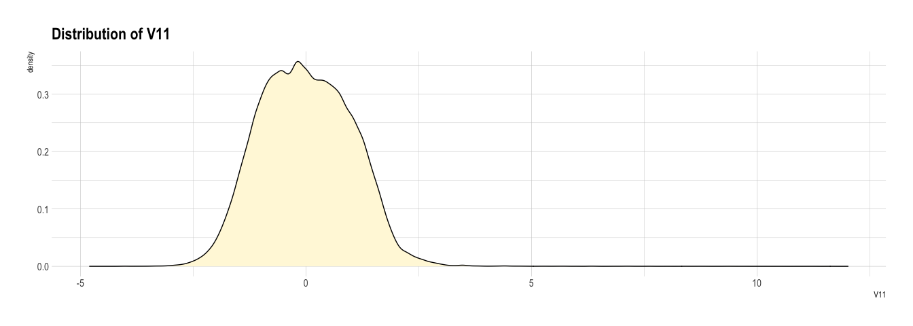
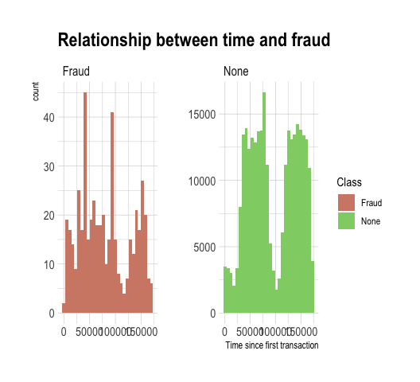
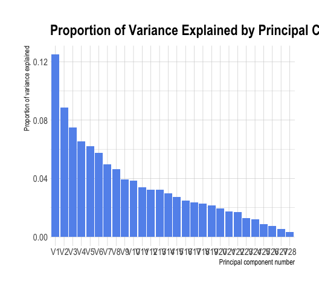
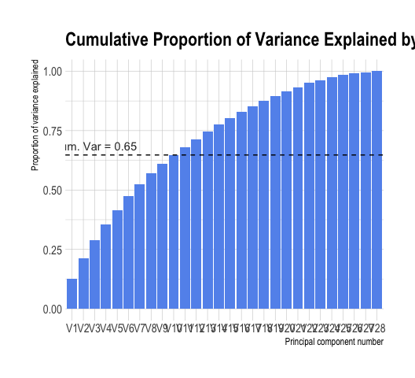

# Set Up


```r
library(tidyverse)
library(here)
library(hrbrthemes)
library(janitor)
library(corrplot)
library(skimr)

RNGkind(sample.kind = "Rounding")
set.seed(1)

theme_set(theme_ipsum())
```


```r
credit <- as_tibble(read_csv(here("data", "creditcard.csv")))
```


```r
credit <- credit %>%
  mutate(
    Class = case_when(
      Class == 0 ~ "None",
      Class == 1 ~ "Fraud"
    )
  ) %>%
  mutate(across(.cols = Class, .fns = factor))
```


# EDA


```r
head(credit)
```

```
## # A tibble: 6 x 31
##    Time     V1      V2    V3     V4      V5      V6      V7      V8     V9
##   <dbl>  <dbl>   <dbl> <dbl>  <dbl>   <dbl>   <dbl>   <dbl>   <dbl>  <dbl>
## 1     0 -1.36  -0.0728 2.54   1.38  -0.338   0.462   0.240   0.0987  0.364
## 2     0  1.19   0.266  0.166  0.448  0.0600 -0.0824 -0.0788  0.0851 -0.255
## 3     1 -1.36  -1.34   1.77   0.380 -0.503   1.80    0.791   0.248  -1.51 
## 4     1 -0.966 -0.185  1.79  -0.863 -0.0103  1.25    0.238   0.377  -1.39 
## 5     2 -1.16   0.878  1.55   0.403 -0.407   0.0959  0.593  -0.271   0.818
## 6     2 -0.426  0.961  1.14  -0.168  0.421  -0.0297  0.476   0.260  -0.569
## # … with 21 more variables: V10 <dbl>, V11 <dbl>, V12 <dbl>, V13 <dbl>,
## #   V14 <dbl>, V15 <dbl>, V16 <dbl>, V17 <dbl>, V18 <dbl>, V19 <dbl>,
## #   V20 <dbl>, V21 <dbl>, V22 <dbl>, V23 <dbl>, V24 <dbl>, V25 <dbl>,
## #   V26 <dbl>, V27 <dbl>, V28 <dbl>, Amount <dbl>, Class <fct>
```

## Variable Summary


```r
anyNA(credit)
```

```
## [1] FALSE
```


```r
skim(credit)
```


Table: Data summary

|                         |       |
|:------------------------|:------|
|Name                     |credit |
|Number of rows           |284807 |
|Number of columns        |31     |
|_______________________  |       |
|Column type frequency:   |       |
|factor                   |1      |
|numeric                  |30     |
|________________________ |       |
|Group variables          |None   |


**Variable type: factor**

|skim_variable | n_missing| complete_rate|ordered | n_unique|top_counts            |
|:-------------|---------:|-------------:|:-------|--------:|:---------------------|
|Class         |         0|             1|FALSE   |        2|Non: 284315, Fra: 492 |


**Variable type: numeric**

|skim_variable | n_missing| complete_rate|     mean|       sd|      p0|      p25|      p50|       p75|      p100|hist  |
|:-------------|---------:|-------------:|--------:|--------:|-------:|--------:|--------:|---------:|---------:|:-----|
|Time          |         0|             1| 94813.86| 47488.15|    0.00| 54201.50| 84692.00| 139320.50| 172792.00|▃▇▅▆▇ |
|V1            |         0|             1|     0.00|     1.96|  -56.41|    -0.92|     0.02|      1.32|      2.45|▁▁▁▁▇ |
|V2            |         0|             1|     0.00|     1.65|  -72.72|    -0.60|     0.07|      0.80|     22.06|▁▁▁▇▁ |
|V3            |         0|             1|     0.00|     1.52|  -48.33|    -0.89|     0.18|      1.03|      9.38|▁▁▁▁▇ |
|V4            |         0|             1|     0.00|     1.42|   -5.68|    -0.85|    -0.02|      0.74|     16.88|▂▇▁▁▁ |
|V5            |         0|             1|     0.00|     1.38| -113.74|    -0.69|    -0.05|      0.61|     34.80|▁▁▁▇▁ |
|V6            |         0|             1|     0.00|     1.33|  -26.16|    -0.77|    -0.27|      0.40|     73.30|▁▇▁▁▁ |
|V7            |         0|             1|     0.00|     1.24|  -43.56|    -0.55|     0.04|      0.57|    120.59|▁▇▁▁▁ |
|V8            |         0|             1|     0.00|     1.19|  -73.22|    -0.21|     0.02|      0.33|     20.01|▁▁▁▇▁ |
|V9            |         0|             1|     0.00|     1.10|  -13.43|    -0.64|    -0.05|      0.60|     15.59|▁▁▇▁▁ |
|V10           |         0|             1|     0.00|     1.09|  -24.59|    -0.54|    -0.09|      0.45|     23.75|▁▁▇▁▁ |
|V11           |         0|             1|     0.00|     1.02|   -4.80|    -0.76|    -0.03|      0.74|     12.02|▁▇▁▁▁ |
|V12           |         0|             1|     0.00|     1.00|  -18.68|    -0.41|     0.14|      0.62|      7.85|▁▁▁▇▁ |
|V13           |         0|             1|     0.00|     1.00|   -5.79|    -0.65|    -0.01|      0.66|      7.13|▁▃▇▁▁ |
|V14           |         0|             1|     0.00|     0.96|  -19.21|    -0.43|     0.05|      0.49|     10.53|▁▁▁▇▁ |
|V15           |         0|             1|     0.00|     0.92|   -4.50|    -0.58|     0.05|      0.65|      8.88|▁▇▂▁▁ |
|V16           |         0|             1|     0.00|     0.88|  -14.13|    -0.47|     0.07|      0.52|     17.32|▁▁▇▁▁ |
|V17           |         0|             1|     0.00|     0.85|  -25.16|    -0.48|    -0.07|      0.40|      9.25|▁▁▁▇▁ |
|V18           |         0|             1|     0.00|     0.84|   -9.50|    -0.50|     0.00|      0.50|      5.04|▁▁▂▇▁ |
|V19           |         0|             1|     0.00|     0.81|   -7.21|    -0.46|     0.00|      0.46|      5.59|▁▁▇▂▁ |
|V20           |         0|             1|     0.00|     0.77|  -54.50|    -0.21|    -0.06|      0.13|     39.42|▁▁▇▁▁ |
|V21           |         0|             1|     0.00|     0.73|  -34.83|    -0.23|    -0.03|      0.19|     27.20|▁▁▇▁▁ |
|V22           |         0|             1|     0.00|     0.73|  -10.93|    -0.54|     0.01|      0.53|     10.50|▁▁▇▁▁ |
|V23           |         0|             1|     0.00|     0.62|  -44.81|    -0.16|    -0.01|      0.15|     22.53|▁▁▁▇▁ |
|V24           |         0|             1|     0.00|     0.61|   -2.84|    -0.35|     0.04|      0.44|      4.58|▁▇▆▁▁ |
|V25           |         0|             1|     0.00|     0.52|  -10.30|    -0.32|     0.02|      0.35|      7.52|▁▁▇▂▁ |
|V26           |         0|             1|     0.00|     0.48|   -2.60|    -0.33|    -0.05|      0.24|      3.52|▁▆▇▁▁ |
|V27           |         0|             1|     0.00|     0.40|  -22.57|    -0.07|     0.00|      0.09|     31.61|▁▁▇▁▁ |
|V28           |         0|             1|     0.00|     0.33|  -15.43|    -0.05|     0.01|      0.08|     33.85|▁▇▁▁▁ |
|Amount        |         0|             1|    88.35|   250.12|    0.00|     5.60|    22.00|     77.16|  25691.16|▇▁▁▁▁ |


```r
for (i in 1:ncol(credit)){
  print(summary(credit[, i]))
}
```

```
##       Time       
##  Min.   :     0  
##  1st Qu.: 54202  
##  Median : 84692  
##  Mean   : 94814  
##  3rd Qu.:139320  
##  Max.   :172792  
##        V1           
##  Min.   :-56.40751  
##  1st Qu.: -0.92037  
##  Median :  0.01811  
##  Mean   :  0.00000  
##  3rd Qu.:  1.31564  
##  Max.   :  2.45493  
##        V2           
##  Min.   :-72.71573  
##  1st Qu.: -0.59855  
##  Median :  0.06549  
##  Mean   :  0.00000  
##  3rd Qu.:  0.80372  
##  Max.   : 22.05773  
##        V3          
##  Min.   :-48.3256  
##  1st Qu.: -0.8904  
##  Median :  0.1799  
##  Mean   :  0.0000  
##  3rd Qu.:  1.0272  
##  Max.   :  9.3826  
##        V4          
##  Min.   :-5.68317  
##  1st Qu.:-0.84864  
##  Median :-0.01985  
##  Mean   : 0.00000  
##  3rd Qu.: 0.74334  
##  Max.   :16.87534  
##        V5            
##  Min.   :-113.74331  
##  1st Qu.:  -0.69160  
##  Median :  -0.05434  
##  Mean   :   0.00000  
##  3rd Qu.:   0.61193  
##  Max.   :  34.80167  
##        V6          
##  Min.   :-26.1605  
##  1st Qu.: -0.7683  
##  Median : -0.2742  
##  Mean   :  0.0000  
##  3rd Qu.:  0.3986  
##  Max.   : 73.3016  
##        V7          
##  Min.   :-43.5572  
##  1st Qu.: -0.5541  
##  Median :  0.0401  
##  Mean   :  0.0000  
##  3rd Qu.:  0.5704  
##  Max.   :120.5895  
##        V8           
##  Min.   :-73.21672  
##  1st Qu.: -0.20863  
##  Median :  0.02236  
##  Mean   :  0.00000  
##  3rd Qu.:  0.32735  
##  Max.   : 20.00721  
##        V9           
##  Min.   :-13.43407  
##  1st Qu.: -0.64310  
##  Median : -0.05143  
##  Mean   :  0.00000  
##  3rd Qu.:  0.59714  
##  Max.   : 15.59500  
##       V10           
##  Min.   :-24.58826  
##  1st Qu.: -0.53543  
##  Median : -0.09292  
##  Mean   :  0.00000  
##  3rd Qu.:  0.45392  
##  Max.   : 23.74514  
##       V11          
##  Min.   :-4.79747  
##  1st Qu.:-0.76249  
##  Median :-0.03276  
##  Mean   : 0.00000  
##  3rd Qu.: 0.73959  
##  Max.   :12.01891  
##       V12          
##  Min.   :-18.6837  
##  1st Qu.: -0.4056  
##  Median :  0.1400  
##  Mean   :  0.0000  
##  3rd Qu.:  0.6182  
##  Max.   :  7.8484  
##       V13          
##  Min.   :-5.79188  
##  1st Qu.:-0.64854  
##  Median :-0.01357  
##  Mean   : 0.00000  
##  3rd Qu.: 0.66251  
##  Max.   : 7.12688  
##       V14          
##  Min.   :-19.2143  
##  1st Qu.: -0.4256  
##  Median :  0.0506  
##  Mean   :  0.0000  
##  3rd Qu.:  0.4931  
##  Max.   : 10.5268  
##       V15          
##  Min.   :-4.49894  
##  1st Qu.:-0.58288  
##  Median : 0.04807  
##  Mean   : 0.00000  
##  3rd Qu.: 0.64882  
##  Max.   : 8.87774  
##       V16           
##  Min.   :-14.12985  
##  1st Qu.: -0.46804  
##  Median :  0.06641  
##  Mean   :  0.00000  
##  3rd Qu.:  0.52330  
##  Max.   : 17.31511  
##       V17           
##  Min.   :-25.16280  
##  1st Qu.: -0.48375  
##  Median : -0.06568  
##  Mean   :  0.00000  
##  3rd Qu.:  0.39968  
##  Max.   :  9.25353  
##       V18           
##  Min.   :-9.498746  
##  1st Qu.:-0.498850  
##  Median :-0.003636  
##  Mean   : 0.000000  
##  3rd Qu.: 0.500807  
##  Max.   : 5.041069  
##       V19           
##  Min.   :-7.213527  
##  1st Qu.:-0.456299  
##  Median : 0.003735  
##  Mean   : 0.000000  
##  3rd Qu.: 0.458949  
##  Max.   : 5.591971  
##       V20           
##  Min.   :-54.49772  
##  1st Qu.: -0.21172  
##  Median : -0.06248  
##  Mean   :  0.00000  
##  3rd Qu.:  0.13304  
##  Max.   : 39.42090  
##       V21           
##  Min.   :-34.83038  
##  1st Qu.: -0.22839  
##  Median : -0.02945  
##  Mean   :  0.00000  
##  3rd Qu.:  0.18638  
##  Max.   : 27.20284  
##       V22            
##  Min.   :-10.933144  
##  1st Qu.: -0.542350  
##  Median :  0.006782  
##  Mean   :  0.000000  
##  3rd Qu.:  0.528554  
##  Max.   : 10.503090  
##       V23           
##  Min.   :-44.80774  
##  1st Qu.: -0.16185  
##  Median : -0.01119  
##  Mean   :  0.00000  
##  3rd Qu.:  0.14764  
##  Max.   : 22.52841  
##       V24          
##  Min.   :-2.83663  
##  1st Qu.:-0.35459  
##  Median : 0.04098  
##  Mean   : 0.00000  
##  3rd Qu.: 0.43953  
##  Max.   : 4.58455  
##       V25           
##  Min.   :-10.29540  
##  1st Qu.: -0.31715  
##  Median :  0.01659  
##  Mean   :  0.00000  
##  3rd Qu.:  0.35072  
##  Max.   :  7.51959  
##       V26          
##  Min.   :-2.60455  
##  1st Qu.:-0.32698  
##  Median :-0.05214  
##  Mean   : 0.00000  
##  3rd Qu.: 0.24095  
##  Max.   : 3.51735  
##       V27            
##  Min.   :-22.565679  
##  1st Qu.: -0.070840  
##  Median :  0.001342  
##  Mean   :  0.000000  
##  3rd Qu.:  0.091045  
##  Max.   : 31.612198  
##       V28           
##  Min.   :-15.43008  
##  1st Qu.: -0.05296  
##  Median :  0.01124  
##  Mean   :  0.00000  
##  3rd Qu.:  0.07828  
##  Max.   : 33.84781  
##      Amount        
##  Min.   :    0.00  
##  1st Qu.:    5.60  
##  Median :   22.00  
##  Mean   :   88.35  
##  3rd Qu.:   77.17  
##  Max.   :25691.16  
##    Class       
##  Fraud:   492  
##  None :284315
```

### Distributions


```r
for (i in names(credit[, -31])) {
  p <- ggplot(credit, aes_string(x = i)) +
    geom_density(fill = "cornsilk") +
    labs(title = paste0("Distribution of ", i))

  print(p)
}
```

<!-- --><!-- --><!-- --><!-- --><!-- --><!-- --><!-- --><!-- --><!-- --><!-- --><!-- --><!-- --><!-- --><!-- --><!-- --><!-- --><!-- --><!-- --><!-- --><!-- --><!-- --><!-- --><!-- --><!-- --><!-- --><!-- --><!-- --><!-- --><!-- --><!-- -->

## Relationship with Response


```r
ggplot(data = credit, aes(x = Time, fill = Class)) +
  geom_histogram() +
  facet_wrap(~Class, scales = "free") +
  labs(title = "Relationship between time and fraud") +
  scale_fill_ipsum()
```

<!-- -->


```r
ggplot(data = credit, aes(x = log(Amount), fill = Class)) +
  geom_histogram() +
  facet_wrap(~Class, scales = "free") +
  labs(title = "Relationship between (log) amount spent and fraud") +
  scale_fill_ipsum()
```

<!-- -->


```r
ggplot(data = credit, aes(x = Time, y = log(Amount), color = Class)) +
  geom_point() +
  facet_wrap(~Class, scales = "free")  +
  labs(title = "Relationship between time and (log) amount spent, by fraud class") +
  scale_color_ipsum()
```

<!-- -->
There is a clear skew to the `Amount` variable, so it is worth applying a transformation to the data. 
As there are values of `0`, we need to add `1` to ensure that we don't get `Inf` values produced after log transformation.


```r
credit <- credit %>%
  mutate(log_amount = log(Amount + 1))

summary(credit$log_amount)
```

```
##    Min. 1st Qu.  Median    Mean 3rd Qu.    Max. 
##   0.000   1.887   3.135   3.152   4.359  10.154
```


```r
ggplot(credit, aes(x = log_amount)) +
    geom_density(fill = "cornsilk")
```

<!-- -->

## Predictor Correlations


```r
corrplot(cor(credit[, -31]), method = "square", type = "upper")
```

<!-- -->

Transformation of `Amount` has helped to reduce collinearities of the predictors.
The only correlations are between `V3` and `Time`, and `V2` and `log_amount`.
This is as expected as PCA produces orthogonal linear combinations,
therefore there shouldn't be much correlation between them.


```r
credit %>%
  mutate(
    trans_time = scale(Time, center = TRUE),
    trans_amount = scale(log_amount, center = TRUE)
    ) %>%
  select(trans_time, everything()) %>%
  select(-c(Amount, Time, log_amount)) %>%
  mutate(across(Class, .fns = as.numeric)) %>%
  cor() %>%
  corrplot(method = "square", type = "upper")
```

<!-- -->

# PCA Importance

Even though we don't have the original data for a full exploration of the PCs,
we can still look at the importance of the individual PCs in explaining the 
total variance in the data as we know that the variance observed in each PC
is equal to its eigenvalue (https://online.stat.psu.edu/stat505/lesson/11/11.2).
Therefore we can still calculate the relative proportions of variance explained,
without needed the eigenvalue outputs of the standard `prcomp` function.


```r
vars <- credit %>%
  select(-c(Time, Amount, log_amount, Class)) %>%
  sapply(var) %>%
  sort(decreasing = TRUE) %>%
  as_tibble()

vars
```

```
## # A tibble: 28 x 1
##    value
##    <dbl>
##  1  3.84
##  2  2.73
##  3  2.30
##  4  2.00
##  5  1.91
##  6  1.77
##  7  1.53
##  8  1.43
##  9  1.21
## 10  1.19
## # … with 18 more rows
```


```r
prop_vars <- vars %>%
  transmute(variance = value) %>%
  mutate(prop_var = variance / sum(variance),
         cum_var = cumsum(prop_var),
         PC = fct_inorder(paste0("V", row_number())))

levels(prop_vars$PC)
```

```
##  [1] "V1"  "V2"  "V3"  "V4"  "V5"  "V6"  "V7"  "V8"  "V9"  "V10" "V11" "V12"
## [13] "V13" "V14" "V15" "V16" "V17" "V18" "V19" "V20" "V21" "V22" "V23" "V24"
## [25] "V25" "V26" "V27" "V28"
```

```r
prop_vars %>%
  ggplot(aes(x = PC, y = prop_var)) +
  geom_col(fill = "cornflowerblue") + 
  labs(title = "Proportion of Variance Explained by Principal Components",
       x = "Principal component number",
       y = "Proportion of variance explained")
```

<!-- -->


```r
prop_vars %>%
  ggplot(aes(x = PC, y = cum_var)) +
  geom_col(fill = "cornflowerblue") + 
  labs(title = "Cumulative Proportion of Variance Explained by Principal Components",
       x = "Principal component number",
       y = "Proportion of variance explained")
```

<!-- -->


